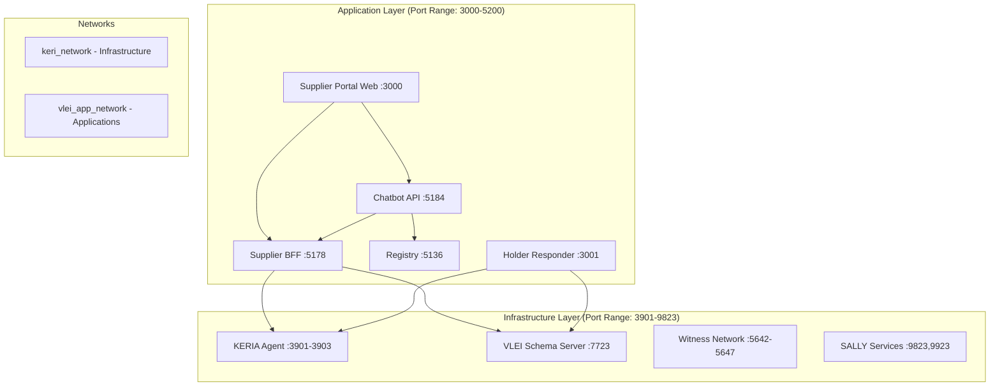

# VLEI Ecosystem Docker Deployment Guide

## 🐳 Overview

This guide provides comprehensive instructions for deploying the complete VLEI ecosystem using Docker containers. The deployment is split into two layers:

1. **Infrastructure Layer** (`vlei-environment/infrastructure-setup/`) - KERI/VLEI core services
2. **Application Layer** (root `docker-compose.yml`) - VLEI business applications

## 🏗️ Architecture



## 🚀 Quick Start

### Prerequisites

- Docker Engine 24.0+ 
- Docker Compose 2.20+
- 8GB+ available RAM
- 20GB+ available disk space
- Azure OpenAI account (for AI features)

### Step 1: Start VLEI Infrastructure

```bash
# Navigate to infrastructure directory
cd vlei-environment/infrastructure-setup

# Start VLEI infrastructure services
docker-compose up -d

# Verify infrastructure health (wait 2-3 minutes for full startup)
docker-compose ps
docker-compose logs vlei-server
docker-compose logs keria
```

### Step 2: Initialize KERIA Entities (CRITICAL STEP)

After the VLEI infrastructure is running, you **must** initialize the core entities and credential schemas in KERIA before the ecosystem can function properly. This step creates the foundational identities and establishes trust relationships between all entities.

```bash
# Navigate to signify console app
cd ../signify-console-app

# Configure environment
cp .env.example .env

# Install dependencies and build
npm install
npm run build

# Run the initialization script
npm start

# Monitor the initialization process - it will:
# 1. Create SignifyClients for all entities
# 2. Initialize entity identifiers (AIDs) for:
#    - GLEIF (Global Legal Entity Identifier Foundation)
#    - QVI (Qualified vLEI Issuer) 
#    - ACME Inc (Sample requesting company)
#    - CRIF (Risk assessment certifier)
#    - AMAZOFF (Sample supplier)
#    - SupplierPortal (Application identity)
# 3. Resolve OOBIs (Out-Of-Band Introductions) between all entities
# 4. Load and resolve all VLEI credential schemas
# 5. Save entity data to entities.json for application use
```

**⚠️ Critical Requirements**:
- This step **must** complete successfully before starting application services
- The KERIA infrastructure must be fully healthy before running this initialization
- All entities and schema relationships are essential for VLEI credential operations
- If this step fails, application services will not be able to process credentials properly

**Expected Output**: The initialization will create entity files and display success messages for each entity creation and OOBI resolution step.

### Step 3: Configure Application Environment

```bash
# Return to root directory
cd ../..

# Copy and configure environment file
cp .env.example .env

# Edit .env file with your Azure OpenAI credentials
nano .env  # or your preferred editor
```

**Required Configuration:**
```bash
# Minimal required configuration
AZURE_OPENAI_ENDPOINT=https://your-instance.openai.azure.com/
AZURE_OPENAI_DEPLOYMENT_NAME=gpt-4
AZURE_OPENAI_API_KEY=sk-your-api-key
```

### Step 3: Start VLEI Applications

```bash
# Build and start application services
docker-compose up -d --build

# Monitor startup process
docker-compose logs -f vlei-infrastructure-check
docker-compose logs -f vlei-registry
docker-compose logs -f vlei-supplier-portal-bff
```

### Step 4: Verify Deployment

```bash
# Check all services are running
docker-compose ps

# Access health endpoints
curl http://localhost:5136/health  # Registry
curl http://localhost:5178/health  # Supplier BFF
curl http://localhost:5184/health  # Chatbot API
curl http://localhost:3000/health.html  # Web Frontend

# Access the application
open http://localhost:3000
```

## ⚙️ Configuration Reference

### Environment Variables

#### 🔑 Azure OpenAI (Required)
```bash
AZURE_OPENAI_ENDPOINT          # Your Azure OpenAI endpoint URL
AZURE_OPENAI_DEPLOYMENT_NAME   # GPT-4 deployment name
AZURE_OPENAI_API_KEY          # Azure OpenAI API key
```

#### 🌐 VLEI Infrastructure URLs
```bash
KERIA_ADMIN_URL               # KERIA admin endpoint (default: http://keria:3901)
KERIA_BOOT_URL                # KERIA bootstrap endpoint (default: http://keria:3903)
KERIA_AGENT_URL               # KERIA agent endpoint (default: http://keria:3902)
VLEI_SCHEMA_SERVER            # VLEI schema server (default: http://vlei-server:7723)
```

#### 🔗 VLEI Schema Identifiers
```bash
VLEI_SUPPLIER_CREDENTIAL_SCHEMA    # Legal Entity vLEI schema SAID
VLEI_RISK_SCHEMA_AID              # Risk assessment badge schema SAID
VLEI_ESG_SCHEMA                   # ESG compliance badge schema SAID
```

#### 🛠️ Service Configuration
```bash
VLEI_LOG_LEVEL                # Logging level (Debug, Information, Warning, Error)
VLEI_CORS_ORIGINS            # Allowed CORS origins
VLEI_ENABLE_EMAIL_GENERATION # Enable HTML email generation (true/false)
VLEI_HOLDER_CONFIGS          # Holder configurations for credential responder
```

### Port Mapping

| Service | Internal Port | External Port | Purpose |
|---------|---------------|---------------|---------|
| **Application Layer** | | | |
| Supplier Portal Web | 3000 | 3000 | React frontend with Nginx |
| Holder Credential Responder | 3001 | 3001 | Automated credential daemon |
| VLEI Registry | 5136 | 5136 | Trust registry and discovery |
| Supplier Portal BFF | 5178 | 5178 | Backend for frontend API |
| Chatbot API | 5184 | 5184 | AI-powered assistant |
| **Infrastructure Layer** | | | |
| KERIA Admin | 3901 | 3901 | Agent management |
| KERIA Agent | 3902 | 3902 | KERI protocol operations |
| KERIA Boot | 3903 | 3903 | Agent bootstrapping |
| Witness Network | 5642-5647 | 5642-5647 | KERI witnesses |
| VLEI Schema Server | 7723 | 7723 | Credential schemas |
| SALLY Hook | 9923 | 9923 | Webhook service |
| Direct SALLY | 9823 | 9823 | Direct mode service |

## 🔧 Advanced Configuration

### Network Configuration

The deployment uses two Docker networks:

1. **keri_network** (External) - Connects to infrastructure services
2. **vlei_app_network** (Internal) - Application service communication

```yaml
networks:
  keri_network:
    external: true
    name: keri_network
  vlei_app_network:
    driver: bridge
    ipam:
      config:
        - subnet: 172.20.0.0/16
```

### Volume Management

Persistent data is stored in Docker volumes:

```bash
# View application data volumes
docker volume ls | grep vlei

# Backup volumes
docker run --rm -v vlei-registry-data:/data -v $(pwd):/backup alpine tar czf /backup/vlei-registry-backup.tar.gz -C /data .

# Restore volumes
docker run --rm -v vlei-registry-data:/data -v $(pwd):/backup alpine tar xzf /backup/vlei-registry-backup.tar.gz -C /data
```

### Service Dependencies

The deployment includes intelligent dependency management:

```yaml
vlei-supplier-portal-web:
  depends_on:
    vlei-chatbot-api:
      condition: service_healthy
    vlei-supplier-portal-bff:
      condition: service_healthy
```

## 🩺 Health Monitoring

### Health Check Endpoints

| Service | Health Check URL | Response |
|---------|-----------------|----------|
| Registry | `http://localhost:5136/health` | `{"status":"Healthy"}` |
| Supplier BFF | `http://localhost:5178/health` | `{"status":"Healthy"}` |
| Chatbot API | `http://localhost:5184/health` | `{"status":"Healthy"}` |
| Web Frontend | `http://localhost:3000/health.html` | `healthy` |

### Monitoring Commands

```bash
# Monitor all services
docker-compose logs -f

# Monitor specific service
docker-compose logs -f vlei-chatbot-api

# Check resource usage
docker stats

# Inspect service health
docker-compose ps
docker inspect vlei-chatbot-api --format='{{.State.Health.Status}}'
```

## 🐛 Troubleshooting

### Common Issues

#### 1. Infrastructure Services Not Ready
```bash
# Check infrastructure services are running
cd vlei-environment/infrastructure-setup
docker-compose ps
docker-compose logs vlei-server
docker-compose logs keria

# Restart infrastructure if needed
docker-compose restart
```

#### 2. Entity Initialization Failures
If the signify-console-app initialization fails, check the following:

```bash
# Verify KERIA services are healthy
curl http://localhost:3901/health
curl http://localhost:3902/health  
curl http://localhost:3903/health

# Check VLEI schema server
curl http://localhost:7723/health

# Review initialization logs
cd vlei-environment/signify-console-app
npm run dev  # Run with detailed logging

# Common issues:
# - KERIA services not fully started (wait 3-5 minutes after docker-compose up)
# - Network connectivity issues between services
# - Missing or incorrect .env configuration
# - Node.js version compatibility (requires Node 18+)

# If entities.json is corrupted or missing, remove and re-run:
rm entities.json matched.json assigned.json revoked.json
npm start
```

#### 3. Azure OpenAI Configuration Issues
```bash
# Verify Azure OpenAI configuration
curl -H "Authorization: Bearer ${AZURE_OPENAI_API_KEY}" \
     "${AZURE_OPENAI_ENDPOINT}openai/deployments/${AZURE_OPENAI_DEPLOYMENT_NAME}/chat/completions?api-version=2024-02-01" \
     -d '{"messages":[{"role":"user","content":"test"}],"max_tokens":1}'
```

#### 3. Network Connectivity Issues
```bash
# Check network connectivity between services
docker exec vlei-chatbot-api curl -f http://vlei-registry:5136/health
docker exec vlei-supplier-portal-bff curl -f http://keria:3901
```

#### 4. Volume Permission Issues
```bash
# Fix volume permissions
docker-compose exec vlei-registry chown -R app:app /app/data
docker-compose exec vlei-supplier-portal-bff chown -R app:app /app/EmailOutput
```

### Log Analysis

```bash
# Check specific service logs
docker-compose logs vlei-chatbot-api | grep ERROR
docker-compose logs vlei-supplier-portal-bff | grep -i exception

# Export logs for analysis
docker-compose logs --no-color > vlei-deployment.log
```

### Service Restart Procedures

```bash
# Restart single service
docker-compose restart vlei-chatbot-api

# Restart all application services
docker-compose restart

# Rebuild and restart specific service
docker-compose up -d --build vlei-supplier-portal-bff

# Force recreate all services
docker-compose up -d --force-recreate
```

## 🔄 Development Workflow

### Local Development Setup

```bash
# Start only infrastructure
cd vlei-environment/infrastructure-setup
docker-compose up -d

# Initialize KERIA entities (required once per infrastructure deployment)
cd ../signify-console-app
npm start

# Run applications locally for development
cd ../..
dotnet run --project vlei-registry &
dotnet run --project vlei-supplier-portal-bff/supplier-bff &
dotnet run --project vlei-ecosystem-agent/vlei-chatbot-api &

# Or run specific services in Docker
docker-compose up -d vlei-registry vlei-supplier-portal-bff
```

**Important**: Always run the entity initialization step after starting fresh VLEI infrastructure, as the applications depend on the entities and schema relationships created by the signify-console-app.

### Hot Reload Development

```bash
# Mount source code for hot reload
docker-compose -f docker-compose.yml -f docker-compose.dev.yml up -d
```

### Testing Configuration

```bash
# Run integration tests
docker-compose exec vlei-supplier-portal-bff dotnet test
docker-compose exec vlei-chatbot-api dotnet test

# Test API endpoints
./test-deployment.sh  # Run comprehensive API tests
```

## 🚦 Production Deployment

### Production Environment File
```bash
# Copy production template
cp .env.example .env.production

# Configure for production
ASPNETCORE_ENVIRONMENT=Production
VLEI_LOG_LEVEL=Warning
VLEI_USE_IN_MEMORY_DB=false
VLEI_DB_CONNECTION_STRING=postgresql://...
```

### Security Considerations

1. **Environment Variables**: Use Docker secrets for sensitive data
2. **Network Security**: Configure firewall rules for exposed ports
3. **TLS Termination**: Use reverse proxy (Nginx/Traefik) with SSL certificates
4. **Resource Limits**: Configure memory and CPU limits
5. **Log Management**: Configure centralized logging (ELK, Fluentd)

### Scaling Configuration

```yaml
# docker-compose.prod.yml
services:
  vlei-supplier-portal-bff:
    deploy:
      replicas: 3
      resources:
        limits:
          memory: 1G
          cpus: '0.5'
```

## 📋 Maintenance

### Regular Maintenance Tasks

```bash
# Update container images
docker-compose pull
docker-compose up -d

# Clean up unused resources
docker system prune -a

# Backup persistent data
./backup-volumes.sh

# Monitor disk usage
df -h
docker system df
```

### Updates and Migrations

```bash
# Update application version
export VLEI_APP_VERSION=1.1.0
docker-compose up -d --build

# Run database migrations (if using persistent DB)
docker-compose exec vlei-supplier-portal-bff dotnet ef database update
```

This deployment configuration provides a robust, scalable foundation for the VLEI ecosystem with comprehensive monitoring, logging, and troubleshooting capabilities.