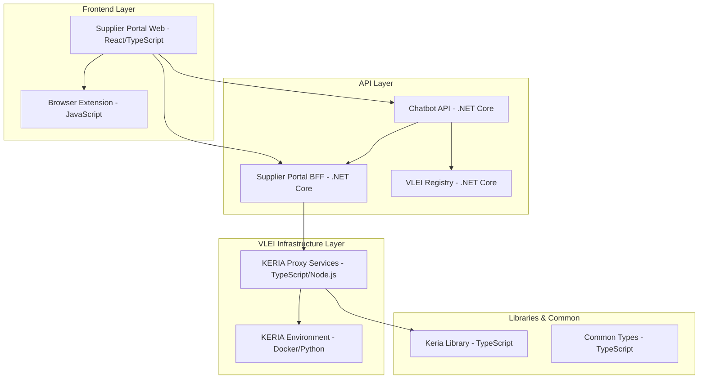
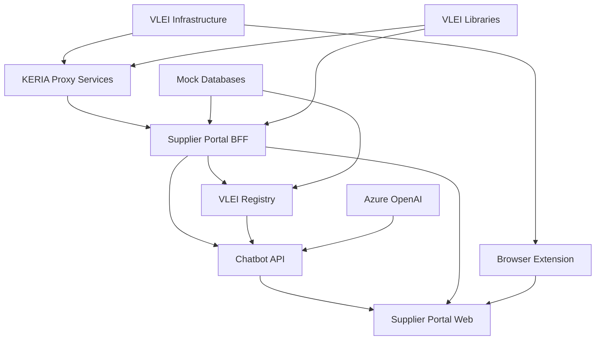

# VLEI Ecosystem Solution - Complete Architecture Overview# vlei-solution


## 🌐 Solution Overview

The **VLEI Ecosystem Solution** is a comprehensive implementation of the Verifiable Legal Entity Identifier (VLEI) framework, providing a complete B2B ecosystem for trusted credential exchange, supplier discovery, and AI-assisted procurement workflows. The solution demonstrates how VLEI credentials enable secure, verifiable business interactions across multiple organizations and services.

## 🏗️ Architecture Components

### Core Components



## 📦 Component Inventory

### 1. 🌐 Frontend Applications

#### vlei-supplier-porta-web
- **Language**: React 18 + TypeScript + Vite
- **Role**: Dual-actor procurement platform with separate interfaces for Alice Alpha Ltd (company) and suppliers
- **Ports**: `5173` (development), `4173` (preview)

**Environment Variables** (`.env.development`):
```env
VITE_SUPPLIER_API_URL=http://localhost:5178    # Supplier Portal BFF
VITE_CHATBOT_API_URL=http://localhost:5184     # AI Chatbot API
```

**Build & Run**:
```bash
cd vlei-supplier-porta-web/supplier-portal
npm install
npm run dev                 # Development server
npm run build              # Production build
npm run preview            # Preview production build
```

**Dependencies**: Supplier Portal BFF, Chatbot API, Browser Extension

---

#### signify-browser-extension
- **Language**: JavaScript (Chrome Extension APIs)
- **Role**: VLEI credential management and authentication interface for browser-based KERI operations
- **Integration**: Provides credential selection and signing capabilities for web applications

**Build & Run**:
```bash
cd signify-browser-extension
#install dependencies
npm install
# Generate build for chrome: the following command generates a build for chrome in [dist/chrome](./dist/chrome/) folder.
npm run build
# Load as unpacked extension in Chrome Developer Mode
```

**Dependencies**: KERIA Environment, VLEI credentials

---

### 2. 🤖 AI & Backend APIs

#### vlei-ecosystem-agent (Chatbot API)
- **Language**: .NET Core 9.0 + Microsoft Semantic Kernel
- **Role**: AI-powered conversational agent with DSL query capabilities and multi-topic threading
- **Port**: `5184` (Chatbot), `5185` (Agent Console)

**Configuration** (`appsettings.json`):
```json
{
  "AzureOpenAI": {
    "PromptConfiguration": "ConfigurationPrompt/",
    "Endpoint": "https://your-azure-openai.openai.azure.com/",
    "DeploymentName": "gpt-4-deployment",
    "ApiKey": "your-api-key"
  },
  "VleiRegistry": { "BaseUrl": "http://localhost:5136" },
  "SupplierPortal": { "BaseUrl": "http://localhost:5178" }
}
```

**Build & Run**:
```bash
cd vlei-ecosystem-agent/vlei-chatbot-api
dotnet build
dotnet run                  # Starts on https://localhost:5184
```

**Dependencies**: Azure OpenAI GPT-4, VLEI Registry, Supplier Portal BFF

---

#### vlei-supplier-portal-bff
- **Language**: .NET Core 9.0
- **Role**: Backend-for-Frontend providing supplier discovery, order management, and DSL query processing
- **Port**: `5178`

**Configuration** (`appsettings.json`):
```json
{
  "Application": {
    "Aid": "application-identifier",
    "Oobi": "http://127.0.0.1:5623/oobi/controller",
    "CredentialSchemaAid": "credential-schema-id",
    "RequiredRiskSchemaCredentialAid": "risk-schema-id"
  },
  "Cors": {
    "AllowedOrigins": ["http://localhost", "https://localhost"],
    "AllowAnyPort": true
  }
}
```

**Build & Run**:
```bash
cd vlei-supplier-portal-bff/supplier-bff
dotnet build
dotnet run                  # Starts on https://localhost:5178
```

**Dependencies**: KERIA Proxy Services, mock Italian company database

---

#### vlei-registry
- **Language**: .NET Core 9.0
- **Role**: Trust registry maintaining lists of trusted applications and certifiers with discovery APIs
- **Port**: `5136`

**Configuration** (`appsettings.json`):
```json
{
  "ApplicationData": [
    {
      "ApplicationId": "supplier-portal",
      "Description": "Portal for supplier discovery",
      "CredentialSchema": "schema-identifier",
      "McpName": "SupplierPortalMcp",
      "ApiUrl": "http://localhost:5178/",
      "PortalUrl": "http://localhost:3000/"
    }
  ],
  "CertifierData": [
    {
      "Id": "CRIF",
      "BadgeTypes": ["risk-schema-id", "company-schema-id"],
      "ContactUri": "https://contact.gleif.org/certifier",
      "Name": "CRIF risk and company information provider"
    }
  ]
}
```

**Build & Run**:
```bash
cd vlei-registry
dotnet build
dotnet run                  # Starts on https://localhost:5136
```

**Dependencies**: In-memory storage (production would use distributed database)

---

### 3. 🔐 VLEI Infrastructure Services

#### vlei-keria-proxy
- **Language**: TypeScript + Node.js + Express
- **Role**: Facade services abstracting VLEI complexity with credential management APIs

**Components**:
- **vlei-keria-api** (Port: `3000`) - REST API for credential operations
- **vlei-holder-credential-responder** - Automated credential presentation daemon
- **vlei-keria-common** - Shared TypeScript library

**Environment Variables** (`.env`):
```env
# KERIA Connection
DEFAULT_ADMIN_URL=http://localhost:3901
DEFAULT_BOOT_URL=http://localhost:3903
SCHEMA_SERVER_HOST=http://localhost:7723

# API Configuration
NODE_ENV=development
PORT=3000
API_VERSION=v1

# Credential Settings
HOLDER_CONFIGS=holder1:bran1,holder2:bran2
DAEMON_CHECK_INTERVAL_MS=5000
MAX_NOTIFICATIONS_PER_BATCH=10
```

**Build & Run**:
```bash
# API Service
cd vlei-keria-proxy/vlei-keria-api
npm install
npm run build
npm run dev                 # Development with auto-reload

# Holder Daemon
cd vlei-keria-proxy/vlei-holder-credential-responder
npm install
npm run build
npm start                   # Background credential responder

# Common Library
cd vlei-keria-proxy/vlei-keria-common
npm install
npm run build
```

**Dependencies**: KERIA Environment, VLEI credentials, signify-ts library

---

#### vlei-environment
- **Language**: Docker Compose + Python (KERI/VLEI services)
- **Role**: Complete VLEI infrastructure including KERIA agents, witnesses, and schema servers

**Services**:
- **vlei-server** (Port: `7723`) - VLEI schema and credential server
- **keria** (Ports: `3901`, `3902`, `3903`) - KERIA agent services
- **witness-demo** (Ports: `5642-5647`) - KERI witness network
- **direct-sally** (Port: `9823`) - Direct mode SALLY service
- **hook** (Port: `9923`) - Webhook service for credential presentations

**Build & Run**:
```bash
cd vlei-environment/infrastructure-setup
docker-compose up -d        # Start all VLEI infrastructure services
docker-compose logs -f      # Follow logs
docker-compose down         # Stop all services
```

**Dependencies**: Docker, Docker Compose, GLEIF VLEI images

---

### 4. 📚 Libraries & Utilities

#### vlei-environment/vlei-keria-library
- **Language**: TypeScript + Node.js
- **Role**: Core VLEI operations library providing credential issuance, verification, and KERI protocol interactions

**Build & Run**:
```bash
cd vlei-environment/vlei-keria-library
npm install
npm run build
npm run build:watch        # Watch mode for development
```

**Dependencies**: signify-ts, KERIA services

---

#### vlei-supplier-portal-common
- **Language**: .NET Core 9.0
- **Role**: Shared models, DTOs, and utilities for supplier portal ecosystem

**Build & Run**:
```bash
cd vlei-supplier-portal-common/vlei-supplier-portal-common
dotnet build
dotnet pack                 # Create NuGet package for sharing
```

---

## � VLEI Credential Schema Reference

The VLEI ecosystem utilizes standardized credential schemas that define the structure and validation rules for different types of verifiable credentials. Each schema is identified by a unique SAID (Self-Addressing Identifier) that cryptographically binds to the schema content.

### Core VLEI Schemas

| Schema Type | SAID | Schema URL | Purpose |
|-------------|------|------------|---------|
| **QVI (Qualified vLEI Issuer)** | `EBfdlu8R27Fbx-ehrqwImnK-8Cm79sqbAQ4MmvEAYqao` | [Schema](http://localhost:7723/oobi/EBfdlu8R27Fbx-ehrqwImnK-8Cm79sqbAQ4MmvEAYqao) | Authorizes entities to issue Legal Entity vLEI credentials |
| **Legal Entity (LE) vLEI** | `ENPXp1vQzRF6JwIuS-mp2U8Uf1MoADoP_GqQ62VsDZWY` | [Schema](http://localhost:7723/oobi/ENPXp1vQzRF6JwIuS-mp2U8Uf1MoADoP_GqQ62VsDZWY) | Establishes verifiable legal identity of organizations |
| **ECR Authorization** | `EH6ekLjSr8V32WyFbGe1zXjTzFs9PkTYmupJ9H65O14g` | [Schema](http://localhost:7723/oobi/EH6ekLjSr8V32WyFbGe1zXjTzFs9PkTYmupJ9H65O14g) | Authorizes individuals to act in specific business contexts |
| **ECR (Engagement Context Role)** | `EEy9PkikFcANV1l7EHukCeXqrzT1hNZjGlUk7wuMO5jw` | [Schema](http://localhost:7723/oobi/EEy9PkikFcANV1l7EHukCeXqrzT1hNZjGlUk7wuMO5jw) | Binds individuals to organizational functions and authority |
| **OOR Authorization** | `EKA57bKBKxr_kN7iN5i7lMUxpMG-s19dRcmov1iDxz-E` | [Schema](http://localhost:7723/oobi/EKA57bKBKxr_kN7iN5i7lMUxpMG-s19dRcmov1iDxz-E) | Authorizes issuance of official organizational roles |
| **OOR (Official Organizational Role)** | `EBNaNu-M9P5cgrnfl2Fvymy4E_jvxxyjb70PRtiANlJy` | [Schema](http://localhost:7723/oobi/EBNaNu-M9P5cgrnfl2Fvymy4E_jvxxyjb70PRtiANlJy) | High-level executive and legal representative credentials |

### Third-Party Attestation Schemas

| Schema Type | SAID | Schema URL | Certifier | Purpose |
|-------------|------|------------|-----------|---------|
| **Certificator** | `EKB7JitBHWnBFzNVeeYeZ9mn93_l_5sR-100MXYxZYJu` | [Schema](http://localhost:7723/oobi/EKB7JitBHWnBFzNVeeYeZ9mn93_l_5sR-100MXYxZYJu) | Various | Authorizes third-party attestation service providers |
| **RiskLens Badge** | `ENiOJlEz0_UMIN-olC06myHv8163njRNjFCnePFNKHZH` | [Schema](http://localhost:7723/oobi/ENiOJlEz0_UMIN-olC06myHv8163njRNjFCnePFNKHZH) | **CRIF** | Risk assessment and credit evaluation credentials |
| **ESG Badge** | `EAag5G3RpOTcIgmCJSkz6h_v4BkFhGDQFFYK2gMBVM7P` | [Schema](http://localhost:7723/oobi/EAag5G3RpOTcIgmCJSkz6h_v4BkFhGDQFFYK2gMBVM7P) | **GreenPuls** | Environmental, Social, and Governance compliance credentials |

### Certifier Profiles

#### **CRIF - Risk Assessment Provider**
CRIF specializes in providing comprehensive **financial risk assessment and creditworthiness evaluation** services through VLEI-enabled credentials. Their RiskLens Badge credentials provide:

- **Credit Risk Analysis**: Detailed credit scoring and default probability assessments
- **Financial Health Metrics**: Cash flow analysis, debt-to-equity ratios, and liquidity indicators  
- **Industry Benchmarking**: Comparative risk analysis within specific industry sectors
- **Real-Time Monitoring**: Continuous risk profile updates based on market conditions
- **Supplier Due Diligence**: Enhanced screening for procurement and supply chain decisions

**Use Case in VLEI Ecosystem**: Procurement officers can request RiskLens Badge credentials to evaluate supplier financial stability before contract awards, ensuring supply chain resilience and reducing financial exposure.

#### **GreenPuls - ESG Compliance Certifier**
GreenPuls provides **Environmental, Social, and Governance (ESG) compliance verification** through comprehensive sustainability assessments. Their ESG Badge credentials include:

- **Environmental Impact Assessment**: Carbon footprint analysis, waste management practices, and resource efficiency metrics
- **Social Responsibility Verification**: Labor practices, community engagement, and human rights compliance
- **Governance Evaluation**: Board diversity, transparency practices, and ethical business conduct
- **Sustainability Reporting**: Alignment with UN Global Compact, GRI standards, and SDG contributions
- **Supply Chain Sustainability**: Vendor ESG performance tracking and improvement recommendations

**Use Case in VLEI Ecosystem**: Organizations can present ESG Badge credentials to demonstrate sustainability commitments to stakeholders, qualify for green procurement programs, and meet regulatory ESG reporting requirements.

### Schema Integration Workflow

1. **Schema Discovery**: Applications query the VLEI Schema Server using OOBI URLs
2. **Credential Validation**: Verify credential structure against schema definitions
3. **Trust Chain Verification**: Validate issuer authority through QVI and GLEIF trust hierarchy
4. **Credential Presentation**: Present verified credentials in business workflows
5. **Automated Verification**: Enable programmatic credential validation in digital processes

---

## �🚀 Quick Start Guide

### Prerequisites

1. **Development Environment**:
   - .NET 9.0 SDK
   - Node.js 18+ and npm
   - Docker and Docker Compose
   - Git

2. **Azure Services**:
   - Azure OpenAI account with GPT-4 deployment
   - API key and endpoint configuration

### Complete Setup (Recommended Order)

#### 1. Start VLEI Infrastructure
```bash
cd vlei-environment/infrastructure-setup
docker-compose up -d
# Wait for all services to be healthy (check with docker-compose ps)
```

#### 2. Initialize KERIA Entities (CRITICAL STEP)
After the VLEI infrastructure is running, you **must** initialize the core entities and credential schemas in KERIA before the ecosystem can function properly. This step creates the foundational identities for GLEIF, QVI, ACME Inc, CRIF, AMAZOFF, and SupplierPortal.

```bash
cd vlei-environment/signify-console-app

# Configure environment (copy from example)
cp .env.example .env

# Install dependencies and build
npm install
npm run build

# Run the initialization script to create entities and resolve schemas
npm start

# This will create:
# - GLEIF (Global Legal Entity Identifier Foundation)
# - QVI (Qualified vLEI Issuer) 
# - ACME Inc (Sample company)
# - CRIF (Risk assessment provider)
# - AMAZOFF (Sample supplier)
# - SupplierPortal (Application entity)
#
# And resolve all VLEI credential schemas between entities
```

**⚠️ Important**: This initialization step is **required** and must complete successfully before starting the application services. The entities and schema relationships created here are essential for the VLEI credential ecosystem to operate.

#### 3. Build Core Libraries
```bash
# Keria Common
cd ../../vlei-keria-proxy/vlei-keria-common
npm install && npm run build

# Supplier Portal Common
cd ../../vlei-supplier-portal-common/vlei-supplier-portal-common
dotnet build
```

#### 3. Start Backend Services
```bash
# VLEI Registry (Terminal 1)
cd vlei-registry
dotnet run

# Supplier Portal BFF (Terminal 2)
cd vlei-supplier-portal-bff/supplier-bff
dotnet run

# Chatbot API (Terminal 3)
cd vlei-ecosystem-agent/vlei-chatbot-api
dotnet run
```

#### 4. Start VLEI Proxy Services
```bash
# KERIA API (Terminal 4)
cd vlei-keria-proxy/vlei-keria-api
cp .env.example .env        # Configure environment
npm install && npm run dev

# Holder Daemon (Terminal 5)
cd vlei-keria-proxy/vlei-holder-credential-responder
cp .env.example .env        # Configure environment
npm install && npm start
```

#### 5. Start Frontend
```bash
# Supplier Portal Web (Terminal 6)
cd vlei-supplier-porta-web/supplier-portal
cp .env.example .env.development    # Configure API endpoints
npm install && npm run dev
```

### Service Health Checks

Once all services are running, verify health:

```bash
# Infrastructure
curl http://localhost:7723/health                    # VLEI Schema Server
curl http://localhost:3901/health                    # KERIA Admin
curl http://localhost:5642/oobi                      # KERI Witnesses

# APIs
curl https://localhost:5136/health                   # VLEI Registry
curl https://localhost:5178/health                   # Supplier Portal BFF
curl https://localhost:5184/health                   # Chatbot API
curl http://localhost:3000/health                    # KERIA API

# Frontend
# Open browser: http://localhost:5173              # Supplier Portal
```

## 🔗 Service Dependencies

### Dependency Graph



### Critical Path Dependencies

**For Full System Operation**:
1. **VLEI Infrastructure** must be running first (Docker services)
2. **VLEI Libraries** must be built before dependent services
3. **VLEI Registry** provides trust data for other services
4. **Supplier Portal BFF** requires Registry and KERIA Proxy
5. **Chatbot API** requires Registry, BFF, and Azure OpenAI
6. **Frontend** requires BFF and Chatbot API
7. **Browser Extension** requires VLEI Infrastructure for credentials

### Optional Dependencies

- **Azure OpenAI**: Required only for AI chatbot functionality
- **KERIA Proxy**: Required only for credential operations
- **Browser Extension**: Required only for VLEI credential authentication

## 📋 Development Workflow

### Typical Development Session

```bash
# 1. Start infrastructure (once per session)
cd vlei-environment/infrastructure-setup && docker-compose up -d

# 2. Initialize KERIA entities (once per fresh infrastructure)
cd ../signify-console-app && npm start

# 3. Start core services (in separate terminals)
cd vlei-registry && dotnet run
cd vlei-supplier-portal-bff/supplier-bff && dotnet run
cd vlei-ecosystem-agent/vlei-chatbot-api && dotnet run

# 4. Start frontend for development
cd vlei-supplier-porta-web/supplier-portal && npm run dev
```

**Note**: The entity initialization (step 2) is only needed once per fresh KERIA infrastructure deployment, or if entity data becomes corrupted.

### Testing Scenarios

**Complete E2E Workflow**:
1. **Company Login**: Alice Alpha Ltd authenticates via browser extension
2. **Order Creation**: Create procurement order with supplier candidates
3. **AI Assistance**: Use chatbot for supplier discovery with DSL queries
4. **Supplier Invitation**: Generate and send LEI-based invitation emails
5. **Supplier Application**: Suppliers authenticate and apply via VLEI credentials
6. **Application Tracking**: Monitor applications and credential verification

## 🛠️ Configuration Management

### Environment-Specific Settings

**Development**:
- All services run on localhost with standard ports
- Mock databases with realistic Italian company data
- Azure OpenAI integration for AI features
- CORS enabled for cross-origin development

**Production Considerations**:
- Distributed database replacement for mock implementations
- HTTPS enforcement and security headers
- Load balancing and service discovery
- Real VLEI credential infrastructure integration
- Monitoring and logging aggregation

## 📊 Monitoring & Debugging

### Service Status Dashboard

| Service | Port | Health Check | Logs Location |
|---------|------|--------------|---------------|
| VLEI Schema Server | 7723 | `/health` | Docker logs |
| KERIA Admin | 3901 | `/health` | Docker logs |
| VLEI Registry | 5136 | `/health` | Console/Application Insights |
| Supplier BFF | 5178 | `/health` | Console/Application Insights |
| Chatbot API | 5184 | `/health` | Console/Application Insights |
| KERIA API | 3000 | `/health` | npm logs |
| Supplier Portal | 5173 | Browser | Browser dev tools |

### Common Troubleshooting

**Service Won't Start**:
- Check port conflicts with `netstat -an | findstr "PORT"`
- Verify configuration files are properly formatted
- Ensure dependencies are built and available

**Authentication Issues**:
- Verify VLEI infrastructure is running and healthy
- Check browser extension is loaded and configured
- Validate credential schemas match between services

**AI Chatbot Issues**:
- Verify Azure OpenAI endpoint and API key configuration
- Check prompt files are loaded from ConfigurationPrompt folder
- Validate service-to-service connectivity

This solution provides a complete, working implementation of the VLEI ecosystem with AI-enhanced supplier discovery, demonstrating the future of trusted B2B interactions through verifiable credentials.