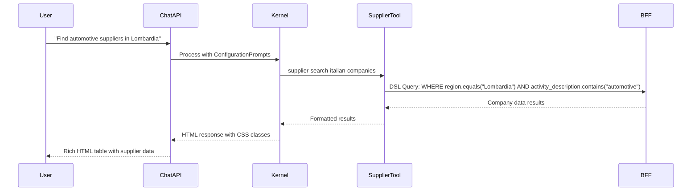

# VLEI Chatbot API - Architecture Documentation

## Overview

The VLEI Chatbot API is an intelligent conversational system built using Microsoft Semantic Kernel and Azure OpenAI. It serves as a B2B ecosystem agent designed to help businesses find and connect with suitable applications and services within the VLEI (Verifiable Legal Entity Identifier) ecosystem. The system provides natural language interfaces for complex business queries with rich HTML responses and multi-topic conversation threading.

## Architecture Components

### Core Framework: Microsoft Semantic Kernel

The chatbot is built on **Microsoft Semantic Kernel 1.64.0**, which provides:

- **AI Orchestration**: Manages interactions between LLM and business tools
- **Plugin System**: Extensible architecture for adding business-specific functions
- **Auto Function Invocation**: Automatic tool calling based on user intent
- **Chat Completion Services**: Conversation management and context preservation
- **Azure OpenAI Integration**: GPT-4 model integration with function calling capabilities

```csharp
// Kernel configuration with auto-function invocation
kernelBuilder.AddAzureOpenAIChatCompletion(
    deploymentName, endpoint, apiKey);

// Plugin registration for business tools
kernel.Plugins.AddFromObject(new SupplierPortalTool(...));
kernel.Plugins.AddFromObject(new ApplicationRegistryAccessTool(...));
kernel.Plugins.AddFromObject(new CertifierRegistryTool(...));
kernel.Plugins.AddFromObject(new ConversationTopicTool());
```

## Implemented Tools & Functions

### 1. SupplierPortalTool
**Purpose**: Italian company data search and supplier discovery

**Key Function**: `supplier-search-italian-companies`
- **DSL Query Engine**: Custom Domain-Specific Language for complex data filtering
- **Advanced Queries**: Supports WHERE clauses, aggregations, sorting, and limits
- **Multi-criteria Search**: Combines fields like employees, credit_limit, region, risk level
- **Risk Normalization**: Handles both Italian (Basso/Medio/Alto) and English (Low/Medium/High) values

```csharp
[KernelFunction("supplier-search-italian-companies")]
[Description("Search Italian companies using DSL query...")]
public async Task<string> SearchItalianCompaniesAsync(string query)
```

**Example DSL Queries**:
```sql
WHERE number_of_employees.greaterThan(100) AND credit_limit.greaterThan(100000) 
SORT credit_limit DESC LIMIT 10

WHERE region.equals("Lombardia") AND risk.equals("Low") 
AGGREGATE COUNT() BY ateco

SELECT name, city, credit_limit WHERE activity_description.contains("automotive")
```

### 2. ApplicationRegistryAccessTool
**Purpose**: VLEI ecosystem application discovery and registration management

**Functions**:
- Application lookup and filtering
- Ecosystem participant discovery
- Service capability matching
- Integration endpoint management

### 3. CertifierRegistryTool  
**Purpose**: Credential certification and validation services

**Functions**:
- Certifier discovery and validation
- Credential schema management
- Trust network navigation
- Certification workflow support

### 4. ConversationTopicTool
**Purpose**: Multi-topic conversation management and threading

**Key Function**: `create-conversation-topic`
- **Thread Creation**: Generates unique thread IDs for distinct topics
- **Metadata Management**: Stores topic names, creation timestamps
- **Multi-topic Detection**: Enables conversation splitting when multiple topics are identified
- **UI Integration**: Provides thread suggestions for frontend display

```csharp
[KernelFunction("create-conversation-topic")]
public Task<string> CreateConversationTopicAsync(string topicName)
```

## Configuration Prompt System

### Prompt Loading Mechanism

The system uses a sophisticated **ConfigurationPrompt** system that dynamically loads instructions from markdown files:

```csharp
// Automatic prompt loading from configured directory
var promptFolder = _configuration.GetSection("AzureOpenAI")["PromptConfiguration"];
var promptFiles = Directory.GetFiles(promptFolder, "*.md");

foreach (var fileName in promptFiles)
{
    var content = await File.ReadAllTextAsync(fileName);
    chatHistory.AddSystemMessage(content);  // Injected into LLM context
}
```

### Configuration Location
- **Path**: `ConfigurationPrompt/` folder in the API project
- **Format**: Markdown files (`.md`) automatically loaded as system messages
- **Dynamic Loading**: Prompts loaded at conversation initialization and message processing

### Core Prompt Files

#### 1. EcosystemB2BAgent.md
**Purpose**: Primary agent behavior and HTML response formatting

**Key Instructions**:
- B2B ecosystem agent role definition
- HTML response structure (3-part: reasoning, content, questions)  
- CSS class usage (NO inline styles)
- Business context and user assistance patterns
- Integration with VLEI ecosystem services

#### 2. DSL_QUERY_GUIDE.md
**Purpose**: Italian company query DSL documentation and syntax

**Content**:
- Complete DSL grammar specification (EBNF notation)
- Data model documentation (company properties)
- Query syntax examples and patterns
- Filtering, sorting, and aggregation operations
- Risk value normalization rules (Italian ↔ English)

**Critical Knowledge**: This prompt teaches the LLM:
- **DSL Syntax**: How to construct proper queries for Italian company data
- **Field Operations**: Available comparison operators (greaterThan, equals, contains, etc.)
- **Query Optimization**: Efficient query patterns for different use cases
- **Data Types**: Understanding of company data structure and relationships

#### 3. CSS_CLASS_BASED_PROMPTS.md  
**Purpose**: HTML styling and CSS class usage guidelines

**Content**:
- CSS class documentation for response formatting
- Component templates (data tables, content lists, summary boxes)
- Visual hierarchy guidelines
- Responsive design considerations
- Style consistency rules

## LLM Knowledge Acquisition

### DSL Query Understanding

The Agent learns DSL syntax through the `DSL_QUERY_GUIDE.md` prompt, which provides:

1. **Grammar Definition**: Complete EBNF specification of query language
2. **Field Mappings**: Understanding of company data model and available fields  
3. **Operation Syntax**: How to construct WHERE clauses, aggregations, sorts
4. **Example Patterns**: Real-world query examples for different business scenarios
5. **Normalization Rules**: Automatic conversion between Italian and English risk values

**Learning Process**:
```markdown
## Data Model (from DSL_QUERY_GUIDE.md)
- vlei: Company VLEI identifier
- name: Company name  
- risk: Risk level (supports both Italian and English values)
  - Italian: Basso, Medio, Alto
  - English: Low, Medium, High
- credit_limit: Credit limit in euros
- number_of_employees: Number of employees

## Query Examples
WHERE number_of_employees.greaterThan(100) AND risk.equals("Low")
SORT credit_limit DESC LIMIT 5
```

### HTML Response Generation

The Agent learns HTML formatting through `CSS_CLASS_BASED_PROMPTS.md` and `EcosystemB2BAgent.md`:

1. **CSS Class System**: Comprehensive class library for different content types
2. **Three-Part Structure**: Reasoning (muted) + Content (primary) + Questions (prominent)
3. **Component Templates**: Pre-defined patterns for tables, lists, summaries
4. **Style Guidelines**: No inline styles, compact HTML, proper emphasis

**HTML Knowledge Patterns**:
```html
<!-- Data comparison tables -->
<div class="data-table">
    <table>
        <tr><th>Company</th><th>Risk</th><th>Credit Limit</th></tr>
        <tr><td><strong>ACME Inc</strong></td><td>Low</td><td class="highlight">€500,000</td></tr>
    </table>
</div>

<!-- Question sections -->  
<div class="question-section">
    <p>Would you like me to search for suppliers in a specific region or industry?</p>
</div>
```

## Conversation Flow & Context Management

### Chat Service Architecture

```csharp
public class ChatService : IChatService
{
    private readonly Kernel _kernel;
    private readonly Dictionary<string, ChatHistory> _conversations; // In-memory state
    private readonly IConfiguration _configuration;
}
```

### Conversation Lifecycle

1. **Initialization**: 
   - Load ConfigurationPrompt files as system messages
   - Create new conversation with unique ID
   - Initialize ChatHistory with business context

2. **Message Processing**:
   - Add user message to conversation history
   - Invoke Semantic Kernel with auto-function invocation
   - Tools automatically called based on user intent
   - Generate HTML-formatted response using CSS classes

3. **Threading Support**:
   - LLM calls `create-conversation-topic` when multiple topics detected
   - Thread metadata stored for UI rendering
   - Frontend receives thread suggestions for conversation organization

### Auto-Function Invocation Filter

```csharp
public class AutoFunctionInvocationFilter : IAutoFunctionInvocationFilter
{
    // Intercepts and logs all function calls
    // Provides user-friendly descriptions of ecosystem interactions
    // Handles error cases and timeout scenarios
}
```

## Integration Patterns

### Frontend Integration
- **REST API**: Standard HTTP endpoints for chat interactions
- **CORS Configuration**: Supports React frontend on multiple ports
- **JSON Responses**: Structured responses with conversation metadata
- **Threading Data**: Thread suggestions and metadata for UI rendering

### Backend Services
- **Supplier Portal BFF**: Italian company data and supplier management
- **VLEI Registry**: Application and certifier registry access  
- **Configuration-Driven**: Service endpoints configured via appsettings.json

### Data Flow Example



## Key Technical Innovations

### 1. **Configuration-Driven Prompts**
- Dynamic loading of business logic via markdown files
- No code changes required for prompt modifications
- Versioned prompt management through source control

### 2. **DSL Integration**
- Custom query language embedded in LLM knowledge
- Complex business queries through natural language
- Automatic query optimization and syntax correction

### 3. **CSS Class-Based Styling**  
- Separation of content and presentation
- Consistent visual hierarchy across all responses
- Responsive design support through CSS classes

### 4. **Multi-Topic Threading**
- LLM-driven conversation organization
- Automatic topic detection and thread creation
- Enhanced user experience through conversation structure

### 5. **Auto-Function Invocation**
- Transparent integration of business tools
- No explicit function syntax required from users
- Natural language to API call translation

This architecture provides a scalable, maintainable, and highly capable conversational AI system specifically designed for B2B ecosystem interactions within the VLEI framework.