# KERI Core: Controllers, Identifiers, and Key Event Logs

  <b>🎯 OBJECTIVE</b>

Explain the fundamental KERI concepts of Autonomic Identifiers (AIDs), the Controller entity, and the Key Event Log (KEL).

Before we dive into creating identifiers and doing operations with the KLI, let's understand two fundamental concepts: **Identifiers** and the **Controller**.

## Autonomic Identifiers (AIDs)

Identifiers are a generic term; they exist in many forms, but here we are concerned with digital identifiers. In a general sense, an identifier is a name, label, or sequence of characters used to uniquely identify something within a given context. Identifiers are useful to assign claims to something or to locate a resource. Common examples of identifiers are domain names, email addresses, ID numbers, and so on.

KERI identifiers are called **Autonomic Identifiers (AIDs)**. They have properties that give them additional capabilities compared to traditional digital identifiers. Their most important attribute is to maintain a stable identifier over time while their controlling keys may be rotated to keep the identifier secure.

There are many different properties of AIDs:
- **Universally Unique:** Like standard UUIDs, AIDs are designed to be globally unique without needing a central issuing authority, thanks to their cryptographic foundation.  
- **Provide asymmetric cryptography features:** Beyond being an identifier, AIDs provide signing and verification capabilities due to being built on public and private key pairs.
- **Cryptographically Bound Control:** AIDs are bound to a set of cryptographic key pairs at time of creation, called the **inception event**, and later key pairs from a **rotation event**; this binding forms the basis of their security and allows the holder of the private key(s) to control the identifier and prove that control through digital signatures and a key event log (KEL).
- - **Control Over Time:** AIDs are designed for persistent control. The identifier's control history and current authoritative keys are maintained in a verifiable **key event log (KEL)**, allowing anyone to determine the current authoritative keys and verify the control history. This enables keys to be rotated (changed) securely over time without abandoning the identifier itself, even if old keys are compromised.
- **Self-Managed:** Unlike traditional identifiers (like usernames or domain names) that rely on central administrators or registries, an AID is managed directly by its owner(s) — known as the Controller — through cryptographic means (specifically, their private keys). This makes AIDs maximally decentralized, directly controlled by end-users. 
- **Self-Certifying:** An AID inherently proves its own authenticity. Its validity stems directly from its cryptographic link to its controlling keys, established at its creation, not from an external authority vouching for it.
- **Authenticates & Authorizes:** The cryptographic nature of an AID allows its Controller to directly prove their control (authenticate) and grant permissions (authorize actions or access related to the AID) without needing a third-party identity system.
- **Multi-Signature Control (Multisig):** An AID does not have to be controlled by only one Controller. KERI supports configurations requiring multiple identifiers, using key pairs held by one or more Controllers, to cooperatively authorize actions. This can involve needing a specific number of signatures (e.g., 3 out of 5) or advanced weighted threshold multi-signature schemes.   
- **Secure Key Rotation (Pre-rotation):** When keys controlling an AID need to be changed (rotated), KERI uses a highly secure [pre-rotation](https://trustoverip.github.io/tswg-keri-specification/#key-rotationpre-rotation) method. In the inception event and each rotation event, a secure commitment is made to the next set of rotation keys that hides the set of actual next public keys by using digests of each next public key. This means the private-public keypair(s) for the next rotation remains unexposed and secure until they are actually needed, protecting the rotation process itself from attack.  
- **Identifier Delegation:** A Controller of one AID can securely grant specific, often limited or revokable, authority as a delegator to another AID, the delegate. This is an important capability for scaling signing operations by using many delegated identifiers in parallel.

Don't worry if these features raise many questions right now. We will explain the "how" behind them gradually in the sections to come.

## The Controller Role

In KERI, the Controller is the entity that holds the private cryptographic key(s) associated with an Autonomic Identifier and is therefore responsible for managing it. This possession of the private key(s) is the source of its authority and control over the AID.  

So, a Controller is an entity managing their identifiers and the key pairs for those identifiers. Some controller scenarios include:
- Personal identity - An individual managing their own digital identity.
- Organizational identity - An organization managing its official identifier.
- Agentic identity - An autonomous piece of software or device managing its own identifier.
- Delegated agentic identity - An autonomous piece of software acting on behalf of a person or organization.   
- Multisignature identity - A group managing a shared identifier via multi-signature schemes. Participants could be people, organizations, or AI agents.

The most important aspect is a Controller has direct access to the private keys the AID is derived from.

While the Controller holds authority over the AID, it relies on software to operate and maintain it. In this training, you will first be using the KLI as the Controller’s tool for interacting with and managing AIDs. Later trainings will include using the Signify and KERIA tooling to interact with AIDs.

## Key Event Logs (KELs) - Never Trust, Always Verify

The Controller's authority more than a trusted assertion, it is proven using cryptography through a verification process. Remember, KERI is a "never trust, always verify" protocol. No matter what statements a Controller makes, those cannot be relied upon unless they can be cryptographically verified. KERI is a "signed everything" architecture with no shared secrets. This means no bearer tokens like JWT and OAuth have. Instead, KERI uses cryptographic signatures to create trust.

The basis of this trust comes from Controllers signing statements with their private key pairs. This means Controllers possess the private keys associated with their AID. They use these keys to sign messages and authorize actions. 

The association between key pairs and an AID is initially formed by what is called the **inception event**, the first event in a **Key Event Log (KEL)**. Every significant action taken by a Controller regarding their AID, like creating the identifier (inception), changing its keys (rotation), or other interactions, is recorded as a **Key Event** in the KEL.

These Key Events are stored sequentially in a **Key Event Log (KEL)**. Think of the KEL as the official history book for an AID. Like a blockchain, a KEL is a hash-chained data structure.

### Key Event Log diagram

```mermaid
graph RL
    %% Define event nodes
    ICP["Inception 🔑"]
    ROT1["Rotation 1 🔑"]
    ROT2["Rotation 2 🔑"]
    IXN1["Interaction 1 ⚓"]

    %% Define backward chaining
    ROT1 -->  ICP
    ROT2 --> ROT1
    IXN1 --> ROT2

    %% Optional node styling for UML appearance
    classDef eventBox fill:#f5f5f5,stroke:#000,stroke-width:1px,rx:5px,ry:5px,font-size:14px;
    class ICP,ROT1,ROT2,IXN1, eventBox;
```

Here are some details about the KEL

* It starts with the AID's "birth certificate" – the **Inception Event**.
* Every subsequent authorized change (like a key rotation) is added as a new entry, cryptographically linked to the previous one. Each new event is signed by the keys referred to in the last rotation event, or from the inception event if no rotations have occurred yet.
* Anyone can potentially view the KEL to verify the AID's history and current state, but only the Controller(s) can add new, valid events to it.
* There may be multiple copies of a KEL; they can be distributed across a network of witnesses, a concept we will dive deeper into later.

## Advanced Control Mechanisms

Control in KERI can be quite nuanced including single signature, multiple signature (multisig), and delegation in any given AID. While the Controller ultimately holds authority, they can sometimes grant specific permissions to others through delegation. Furthermore, the Controller responsibility may be shared across multiple controlling parties in a multisig AID.

* **Signing vs. Rotation Authority**: A Controller might keep the power to change the AID's keys (rotation authority) but allow another entity (a "custodian") to perform more routine actions like signing messages (signing authority).
* **Delegation**: A Controller can grant some level of authority to a completely separate Delegated Identifier. This allows for creating scalable signing infrastructure with delegation hierarchies that can model complex organizational or authority structures.

We'll explore these advanced concepts like delegation and multisig configurations in later sections.

# Types of Autonomic Identifiers

## Transferable AID

A transferable AID may rotate keys and thus may have inception, rotation, and interaction events in its key event log. Most controllers that are not witnesses will use transferable AIDs. Any AID that issues credentials will be a transferable AID.

- Example transferable AID: `EIkO4CUmYXukX4auGU9yaFoQaIicfVZkazQ0A3IO5biT`
  - Notice the 'E' at the start.

## Non-transferable AID

A non-transferable AID cannot rotate keys and only ever has one event, the inception event, in its key event log. Use cases for non-transferable AIDs include witnesses, IoT devices, ephemeral identifiers, or anywhere that signing capabilities are needed where rotation capabilities are not.

You can visually see the difference between a non-transferable AID and a transferable AID because a non-transferable AID starts with the "B" character as shown here:
- `BBilc4-L3tFUnfM_wJr4S4OJanAv_VmF_dJNN6vkf2Ha`
  - Notice the 'B' at the start.

  <b>📝 SUMMARY</b>

Fundamental KERI concepts:

<ul>
    <li><strong>Autonomic Identifiers (AIDs):</strong> These are KERI's unique, self-managing digital identifiers. Unlike traditional IDs, they are cryptographically bound to key pairs from creation, are self-certifying (requiring no central authority), and support features like secure key rotation (pre-rotation), multi-signature control, and delegation.</li>
    <li><strong>Controller:</strong> The entity (person, organization, software), or entities in the case of multisig, holding the private key(s) for an AID, giving it the authority to manage the identifier and authorize actions.</li>
    <li><strong>Key Event Log (KEL):</strong> The secure, append-only, hash-chained data structure serving as a verifiable key history for an AID. It records all significant actions (like creation and key rotations) signed by the Controller, allowing anyone to track the identifier's control provenance. A KEL may also store interaction events for anchoring arbitrary data to a KEL, sort of like anchoring data to a blockchain. We will explore this deeply in a future lesson.</li>
</ul>

In essence, Controllers use their private keys to manage AIDs, and all authoritative actions are recorded in the KEL.

[<- Prev (Controllers and Identifiers)](101_10_KERI_Command_Line_Interface.ipynb) | [Next (Working with Keystores and AIDs with the KLI) ->](101_20_Working_with_Keystores_and_AIDs_via_KLI.ipynb)
