# Digital Signatures in KERI

<div class="alert alert-primary">
  <b>🎯 OBJECTIVE</b><hr>
    Explain digital signatures, how to verify a digital signature using the KLI verify command, and understand how tampering affects signature validity.
</div>


## Fundamentals of Digital Signatures

Having explored KERI Identifiers (AIDs) and their management, we now focus on digital signatures. This section explains what digital signatures are, their crucial properties, and how they operate within KERI.

A digital signature is a cryptographic mechanism used to provide assurance about the authenticity and integrity of digital data. It serves a similar purpose to a handwritten signature but offers significantly stronger guarantees through cryptography.


The process involves two stages:

1.  **Signing:** (see SIGNING PROCESS diagram below)
    * The signer (e.g., an AID Controller) begins with the information they want to sign.
    * They then create a condensed, fixed-length representation of that information — called a digest — by applying a hash function.
        * A note on terminology: While the term "hash" is often used to refer to both the function and its output, in this text we will use “hash function” to refer to the algorithm and “digest” to refer to its output.
    * Next, the signer uses their unique private signing key to apply a digital signature algorithm to the digest. This process produces a digital signature — a cryptographic proof that the signer authorized the original data.
    * Only someone with access to the private key can generate a valid signature for a given digest. 
    * The generated signature is typically attached to the original information. In the case of KERI this signature is encoded in the [Composable Event Streaming Representation](https://trustoverip.github.io/tswg-cesr-specification/) (CESR) encoding format.

```mermaid
graph TD

    subgraph "COLOR LEGEND"
        L1["📊 Input/Output Data"]
        L2["⚙️ Algorithms/Functions"]
        L4["🔐 Private Key"]
        L5["🔑 Public Key"]
    end
    
    style L1 fill:#e3f2fd
    style L2 fill:#f3e5f5
    style L4 fill:#ffcdd2
    style L5 fill:#bbdefb
    
```

```mermaid
graph TD
    subgraph "SIGNING PROCESS"
        A["Original Message: 'Transfer $1000 to Alice'"] --> B["Hash Function: e.g., SHA-256"]
        B --> C["Message Digest: '0x3b7e72...'"]
        C --> D["Signing Algorithm"]
        E["Private Key 🔐"] --> D
        D --> F["Digital Signature"]
        F --> G["Signature + Message"]
        A -.-> G
    end
    
    G --> H["📤 Transmitted over network"]
    
    style A fill:#e3f2fd
    style B fill:#f3e5f5
    style C fill:#e3f2fd
    style D fill:#f3e5f5
    style E fill:#ffcdd2
    style F fill:#e3f2fd
    style G fill:#e3f2fd
    style H fill:#f5f5f5

```





2.  **Verification:**
    * Anyone receiving the information and signature can verify its validity using the signer's corresponding public key.
    * The verifier applies a verification algorithm using the original information, the signature, and the corresponding public key from the correct point in history of a KEL.
    * This algorithm is the complement of the signing process. It uses the public key to mathematically validate that the signature corresponds to the digest of the raw information. The verification algorithm applies mathematical operations (which vary by signature scheme) to confirm the signature was created with the corresponding private key for the given digest. If the mathematical verification succeeds, the signature is valid; otherwise, it fails.
    * **Outcome:**
        * **Valid Signature:** If the signature verification succeeds, the verifier has high confidence in the information's authenticity, integrity, and non-repudiability and can trust the data and its originator.
        * **Invalid Signature:** If the signature fails verification the information may have been tampered with, the signature might be corrupt, or the legitimate holder of the private key didn't generate it. Thus the verifier should not trust the data.
    * Successful verification confirms:
        * **Authenticity:** The information originated from the owner of the key pair.
        * **Integrity:** The information has not been altered since it was signed.
        * **non-repudiability**: The signer cannot successfully deny signing the information. Because generating the signature requires the private key (which should be kept secret by the owner), a valid signature serves as strong evidence of the signer's action.

```mermaid
graph TD


    
    subgraph "VERIFICATION PROCESS"
        H["📥 Received Message + Signature"] --> I["Separate Components"]
        I --> J["Original Message: 'Transfer $1000 to Alice'"]
        I --> K["Received Signature"]
        J --> L["Hash Function: e.g., SHA-256"]
        L --> M["Computed Digest: '0x3b7e72...'"]
        M --> N["Verification Algorithm"]
        K --> N
        O["Public Key 🔑"] --> N
        N --> P{Valid?}
        P -->|Yes| Q["✅ Authentic, Unmodified, Non-repudiable"]
        P -->|No| R["❌ Untrusted, Possibly tampered, or wrong key"]
    end
    
    style H fill:#e3f2fd
    style I fill:#f3e5f5
    style J fill:#e3f2fd
    style K fill:#e3f2fd
    style L fill:#f3e5f5
    style M fill:#e3f2fd
    style N fill:#f3e5f5
    style O fill:#bbdefb
    style P fill:#f5f5f5
    style Q fill:#c8e6c9
    style R fill:#ffcdd2
    
```




## Verification Process in KERI

In KERI, digital signatures are fundamental for establishing trust and verifying the authenticity of Key Events and other interactions associated with an AID. They cryptographically link actions and data back to the identifier's controlling keys.

While the verification algorithm is standard, the key challenge for a Verifier is obtaining the correct public key(s) that were authoritative for the AID when the information was signed.

The Verifier must perform these steps:

1.  **Identify the Authoritative Public Key(s):**
    * For an AID's inception event, the AID prefix is derived from the initial public key(s) (leveraging KERI's self-certifying nature).
    * For subsequent events (like rotations or interactions), the Verifier must consult the AID's Key Event Log to get the most up to date controlling key pair(s). The KEL provides the history of key changes, allowing the Verifier to determine which public key(s) were valid at the specific point in time the event or message was signed.

2.  **Perform Cryptographic Verification:**
    * Once the correct public key(s) are identified, the Verifier uses them, along with the received data and signature, in the standard cryptographic verification algorithm (as described earlier).

This reliance on the KEL to track key state over time is crucial for maintaining the security of interactions with KERI identifiers long after their initial creation.

<div class="alert alert-info">
  <b>ℹ️ NOTE</b><hr>
    There's a subtle difference between a <b>Verifier</b> (who checks cryptographic correctness according to KERI rules) and a <b>Validator</b> (who might perform broader checks, including business logic, and broader trust policies in addition to verification). In KERI discussions, "Verifier" typically emphasizes the cryptographic checks.
</div>

## KLI Examples: Signing and Verifying

Let's see how signing and verification work using the KLI commands.

### Initial Setup

First, create a keystore and an identifier.


```python
# Imports and Utility functions
from scripts.utils import clear_keri
clear_keri()

keystore_name="signature-keystore"
passcode="xSLg286d4iWiRg2mzGYca"
salt="0ABeuT2dErMrqFE5Dmrnc2Bq"
aid_alias = "aid-signature"

!kli init --name {keystore_name} \
    --passcode {passcode} \
    --salt {salt}

!kli incept --name {keystore_name} \
    --passcode {passcode} \
    --alias {aid_alias} \
    --icount 1 \
    --isith 1 \
    --ncount 0 \
    --nsith 0 \
    --toad 0
```

    Proceeding with deletion of '/usr/local/var/keri/' without confirmation.
    ✅ Successfully removed: /usr/local/var/keri/


    KERI Keystore created at: /usr/local/var/keri/ks/signature-keystore
    KERI Database created at: /usr/local/var/keri/db/signature-keystore
    KERI Credential Store created at: /usr/local/var/keri/reg/signature-keystore
    	aeid: BD-1udeJaXFzKbSUFb6nhmndaLlMj-pdlNvNoN562h3z


    Prefix  BCtRkWLNdWNRvB8L5gYMaLkanJQWi8wGbmmAtEw9XSWw
    	Public key 1:  BCtRkWLNdWNRvB8L5gYMaLkanJQWi8wGbmmAtEw9XSWw
    


### Signing Data

Now, sign a simple text message using the private key associated with the `aid-signature` identifier. To do so use the command `kli sign` presented below:


```python
!kli sign --name {keystore_name} \
    --passcode {passcode} \
    --alias {aid_alias} \
    --text "hello world"
```

    1. AABjrlljacVpT8kDsvzv3qCVR1iiwJ-XPaAiKDURCH_vdrkgJgLK4i9h2Qv-xxmT2UxCSif0C-Ovvx-xp2vVDJUB


The output is the digital signature generated for the text "hello world" using the private key of the AID. This digital signature is encoded in text format with the CESR encoding protocol, the core cryptographic primitive, text, and binary encoding protocol used in the KERI and ACDC protocols.

### Verifying a Valid Signature

You can now use the `kli verify` command to check if the signature is valid for the given message and identifier (prefix). The relevant parameters here are:
- `--prefix`: The prefix of the signer
- `--text`: original text
- `--signature`: signature to verify


```python
!kli verify --name {keystore_name} \
    --passcode {passcode} \
    --alias {aid_alias} \
    --prefix BCtRkWLNdWNRvB8L5gYMaLkanJQWi8wGbmmAtEw9XSWw \
    --text "hello world" \
    --signature AABjrlljacVpT8kDsvzv3qCVR1iiwJ-XPaAiKDURCH_vdrkgJgLK4i9h2Qv-xxmT2UxCSif0C-Ovvx-xp2vVDJUB

```

    Signature 1 is valid.


The command confirms the signature is valid. It used the public key associated with the prefix to verify the signature against the provided text.

### Impact of Tampering

What happens if the signature is altered even slightly? The next command has the last character of the signature modified from "B" to "C" which will cause verification to fail.

Try to verify again.


```python
!kli verify --name {keystore_name} \
    --passcode {passcode} \
    --alias {aid_alias} \
    --prefix BCtRkWLNdWNRvB8L5gYMaLkanJQWi8wGbmmAtEw9XSWw \
    --text "hello world" \
    --signature AABjrlljacVpT8kDsvzv3qCVR1iiwJ-XPaAiKDURCH_vdrkgJgLK4i9h2Qv-xxmT2UxCSif0C-Ovvx-xp2vVDJUC # Tampered last character
```

    ERR: Signature 1 is invalid.


As expected, the verification fails. Even a tiny change invalidates the signature, demonstrating the integrity protection it provides.

<div class="alert alert-prymary">
<b>📝 SUMMARY</b><hr>
<ul>
<li><strong>Digital Signature Process:</strong> Data is signed by first creating a condensed representation (a digest) using a hash function, and then applying a signing algorithm to that digest using a private key. The result is a digital signature.</li>
<li><strong>Verification:</strong> To verify a signature, the recipient uses the signer's public key and the signature to validate the digest. They also compute the digest of the received data independently. If the two digests match, the signature is valid.</li>
<li><strong>Core Guarantees:</strong> A valid digital signature confirms <strong>authenticity</strong> (the message came from the key owner), <strong>integrity</strong> (the message wasn't altered), and <strong>non-repudiability</strong> (the signer cannot deny their action).</li>
<li><strong>KERI's Key Management:</strong> In KERI, the crucial step for a verifier is finding the correct public key that was authoritative at the time of signing. This is accomplished by consulting the identifier's <strong>Key Event Log (KEL)</strong>, which provides the secure, verifiable history of key changes.</li>
<li><strong>Practical Demonstration:</strong> The <code>kli sign</code> command generates a signature, while <code>kli verify</code> checks it. Even a minor alteration to the signature or the original data will cause the verification to fail, demonstrating the cryptographic security of the process.</li>
</ul>
</div>

[<- Prev (Working with Keystores and AIDs via KLI)](101_20_Working_with_Keystores_and_AIDs_via_KLI.ipynb) | [Next (Rotation) ->](101_30_Key_Rotation.ipynb)
