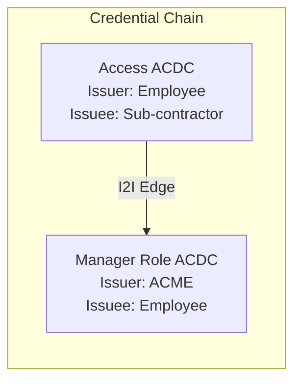
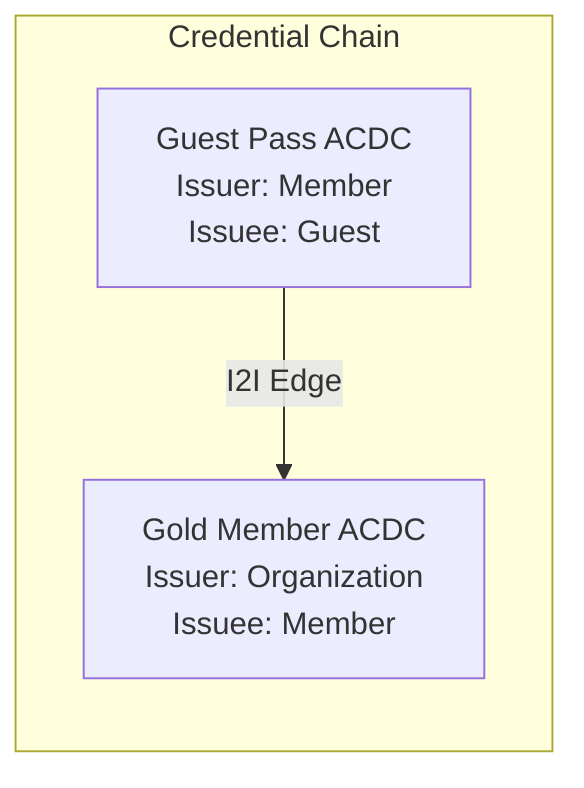
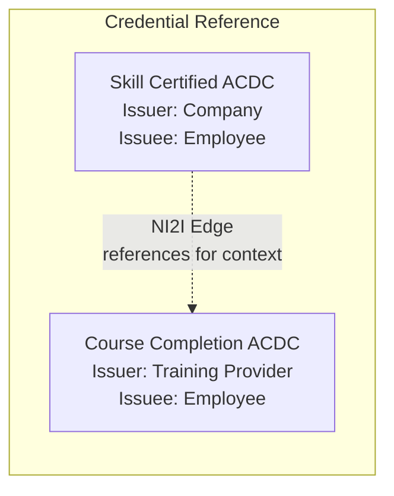
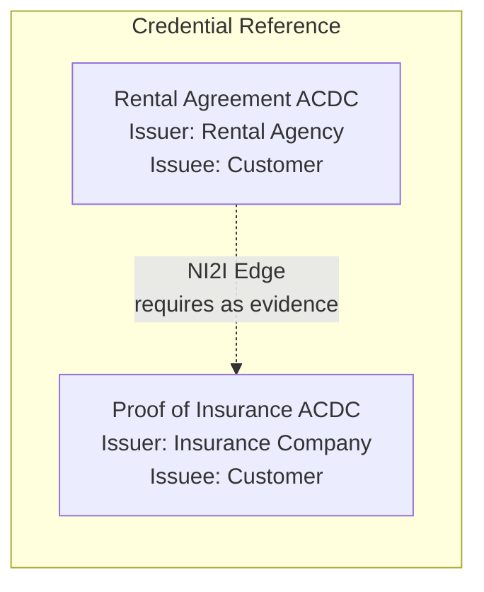
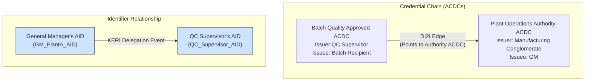

# Advanced ACDC Features: Edges, Edge Operators, and Rules

  <b>🎯 OBJECTIVE</b>

    Introduce the concept of Edges in ACDCs, explain the Edge operators (I2I, NI2I, DI2I) that define relationships between chained ACDCs, illustrate their use with conceptual scenarios, and briefly introduce Rules as a component for embedding legal language and conditions within the ACDC.

## Understanding Edges and Rules
 
Authentic Chained Data Containers (ACDCs) are not always standalone credentials. One of their features is the ability to be cryptographically linked to other ACDCs forming verifiable chains of information. These links, or chains, are defined in the `e` (edges) section of an ACDC's payload.

### ACDC Edges Section

The term "edge" is used because a chain of ACDCs is a graph data structure, specifically a directed acyclic graph, a DAG. In a graph there are nodes and edges and parent nodes are pointed to by child nodes. A child is any node that points to another node. A parent is a node that is pointed to by at least one other node. ACDCs in a chain are the nodes and the edges are references included within an ACDC that point to another ACDC.

The diagram below shows the following set of credentials and their edges:
- ACDC A is issued by identifier One to Two and has no edges.
- ACDC B is issued by identifier Two to Three and has an edge pointing to the A credential.
- ACDC C is issued by identifier Three to Four and has an edge pointing to the B credential.

As you can see edges allow the chaining of credentials to previously issued credentials which allows a verifier to traverse the entire chain of credentials and perform cryptographic verifications and business logic validations on each link in the chain as well as the entire chain at once. This sort of credential stacking allows advanced issuance and verification workflows that can work across trust boundaries and across legal jurisdictions.
Credential chaining in this way is one of the **most powerful** features of the KERI and ACDC protocol stack.

Building on this power, edge operators enable different kinds of credential chains, or subchains to be created for a variety of purposes.

### Edge Operators

As shown above, edges allow an ACDC to point to one or more ACDCs establishing a verifiable relationship between them. Edges define the kind of relationship between a child and a parent ACDC. This relationship is expressed as an **Edge Operators** which dictates the rules between the issuer and issuee of the connected ACDCs.

Understanding these operators is crucial for designing ACDC ecosystems that model real-world authority, delegation, and contextual relationships. In this notebook we will focus on three unary edge operators and when to use each:

* **I2I (Issuer-To-Issuee)** - the default; issuer of child ACDC is issuee of parent ACDC.
* **NI2I (Not-Issuer-To-Issuee)** - useful for untargeted ACDCs; issuer has no relationship to parent credential issuee.
* **DI2I (Delegated-Issuer-To-Issuee)** - issuer of child ACDC may be issuee or KEL delegate of issuee of parent ACDC.

We will explore what each operator signifies and provide scenarios to illustrate their practical application.

Edge operators provide the logic for validating the link between two ACDCs. They answer questions like: "Does the issuer of this ACDC need to be the subject of the ACDC it's pointing to?" or "Can the issuer be someone delegated by the subject of the linked ACDC?"

### ACDC Rules Section

Beyond these structural links, ACDCs also feature a dedicated `r` (rules) section. This section allows for the embedding of machine-readable logic, conditions, or even legal prose directly within the credential. While edges define how ACDCs are connected, rules can define additional constraints or behaviors associated with the ACDC itself or its relationships.

The rules section is currently somewhat simple and mostly used for specification of legal prose declaring the terms of use for a credential. The rest of this training explores the use of edge operators.

## I2I Operator: Issuer-To-Issuee

The Issuer to Issuee (I2I) operator is the **implicit default** for any credential created by the reference implementation, KERIpy, and does not need to be specified explicitly during ACDC creation. As shown in the diagram below, this operator means that the *issuer* of a *child* credential MUST be referenced as the *issuee* of the *parent* credential. This is a **strict** constraint.

The core idea behind an I2I edge is to represent a direct chain of authority. The issuer of the current ACDC (the "near" ACDC containing the edge) is asserting its claims based on its status as the issuee of the ACDC it's pointing to (the "far" ACDC).

I2I signifies: "My authority to issue this current ACDC may come from or otherwise involve the fact that I am the subject of the ACDC I am pointing to."

### I2I Scenario Examples

1.  **Endorsement for Building Access:**

  
* **Scenario:** A company (ACME) issues a "Manager role" ACDC to an Employee. The Employee (now acting as an issuer by virtue of their managerial role) then issues an "Access" ACDC for a specific building to a sub-contractor they hired. The "Access" ACDC would have an I2I edge pointing back to the employee's "Manager role" ACDC.

| **Issuer** | **Issuee**      | **Credential** | **I2I Edge** |
|------------|----------------|----------------|--------------|
| ACME       | Employee       | Manager role   | N/A          |
| Employee   | Sub-contractor | Access         | Manager role |

* **Diagram representation:**

* **Significance:** The I2I edge ensures the Manager issuing access is verifiably the same member to whom ACME conferred managerial status.

    In this case the door access management device acting as the **verifier** would check to ensure that the Access ACDC was issued with an I2I edge and that the *issuer* of the Access ACDC was indeed the *issuee* of the Manager role ACDC.

2.  **Membership Level Endorsement for Event Access:**

* **Scenario:** An Organization issues a "Gold Member" ACDC to an member. This member (Gold Member) then wants to bring a guest to an exclusive event. The organization's policies (which are embedded in the `r` section of the "Gold Member" ACDC) allow Gold Members to issue "Guest Pass" ACDCs. The "Guest Pass" issued by the Gold Member would have an I2I edge pointing to their "Gold Member" ACDC.

| **Issuer**   | **Isuee** | **Credential** | **I2I Edge** |
|--------------|-----------|----------------|--------------|
| Organization | Member    | Gold Member    | N/A          |
| Member       | Guest     | Guest Pass     | Gold Member  |

* **Diagram representation:**

* **Significance:** The validity of the guest pass relies on the issuer being a verified Gold Member, as established by the I2I link, and governed by additional rules specified in the r section (e.g., limit on number of guest passes).

    In this case the door access point verifier would verify that the edge type was I2I and that the Gold Member was both the *issuer* of the Guest Pass ACDC and the *issuee* of the Gold Member ACDC.

### Use Cases for I2I

1.  **Delegation of Authority with Credentials:** When an entity that was the subject (issuee) of a credential (e.g., "Manager Role") now needs to issue a subsequent credential by leveraging that conferred authority (e.g., "Project Approval" issued by the manager). 
2.  **Endorsement:** If one credential's authority directly enables the issuance of another by the same entity acting in a new capacity.
3.  **Hierarchical Relationships:** When representing a clear hierarchy where an entity's position (as an issuee of a credential defining that position) allows them to issue credentials further down the chain.
4.  **Sequential Processes:** In workflows where an entity receives a credential (making them an issuee) and then, as a next step in the process, issues another credential related to that item. Supply chain or multi-step workflows are areas where this would apply.
5.  **Default Expectation for Targeted ACDCs:** If the far node (the ACDC being pointed to) is a "Targeted ACDC" (i.e., has an issuee), the I2I operator is the default assumption unless otherwise specified. This implies a natural flow where the issuee of one ACDC becomes the issuer of the next related ACDC.

## NI2I Operator: Not-Issuer-To-Issuee

The NI2I operator is a **permissive** edge operator that allows any and all identifiers to chain a child ACDC onto a parent ACDC regardless of whether the issuer of the child ACDC is related to the parent ACDC in any way. The diagram below shows that Identifier Three can chain child ACDC B to parent ACDC A even though Three is not the issuee of parent ACDC A. Identifier Two is the recipient of both parent ACDC A and child ACDC B.

The purpose of the NI2I edge is to reference, associate, or link to another ACDC for context, support, or related information, where there isn't a direct delegation of authority or a requirement for the issuer of the current ACDC to be the subject of the referenced ACDC.

NI2I means that this ACDC I am pointing to provides relevant context, support, or related information for my current ACDC, but my authority to issue this current ACDC does not stem from my being the subject of that linked ACDC.

This sort of relationship is more decoupled than I2I and is more applicable to scenarios where the issuer of the parent credential is not necessarily related to or affiliated with the issuer of the child credential or does not want a strict relationship between the parent and child credentials.

### NI2I Scenario Examples

1.  **Linking to an External Training Course Completion Certificate:**

* **Scenario:** A Company issues an "Skill Certified" ACDC to an employee after they complete an internal assessment. The employee also completed an external, third-party training course relevant to this skill. The "Skill Certified" ACDC could have an NI2I edge pointing to the "Course Completion" ACDC issued by the external Training Provider.

| **Issuer**        | **Issuee** | **Credential**    | **NI2I Edge**     |
|-------------------|-----------|-------------------|-------------------|
| Training Provider | Employee  | Course Completion | N/A               |
| Company           | Employee  | Skill Certified   | Course Completion |

* **Diagram representation:**

 
* **Significance:** The company acknowledges the external training as supporting evidence. The `r` (rules) section of the "Skill Certified" ACDC could specify how this external certification contributes to the overall skill validation (e.g., "External certification X fulfills requirement Y").

2.  **Proof of Insurance for a Rental Agreement:**

* **Scenario:** A Car Rental Agency issues a "Rental Agreement" ACDC to a Customer. The customer is required to have valid car insurance. The "Rental Agreement" ACDC could have an NI2I edge pointing to the Customer's "Proof of Insurance" ACDC, which was issued by an Insurance Company.

| **Issuer**        | **Issuee** | **Credential**     | **NI2I Edge**      |
|-------------------|-----------|--------------------|--------------------|
| Insurance Company | Customer  | Proof of Insurance | N/A                |
| Rental Agency     | Customer  | Rental Agreement   | Proof of Insurance |

* **Diagram representation:**

* **Significance:** The rental agreement relies on the existence of an insurance policy. The `r` section of the "Rental Agreement" ACDC would likely contain critical rules defining the terms of the rental, insurance coverage requirements (e.g., minimum liability), and consequences of non-compliance, which are legally binding.

### Use Cases for NI2I

1.  **Referencing External Information:** When an ACDC needs to point to an ACDC that was issued by a third party and not specifically to the issuer of the current ACDC. The `r` (rules) section of the referencing ACDC might contain specific clauses on how that external information applies.
2.  **Providing Supporting Evidence from Third Parties:** Linking to credentials issued by other independent parties that support a claim in the current ACDC.
3.  **Associating Related but Independent Credentials:** When linking credentials that are related but don't follow a direct chain of delegated authority from the same entity.
4.  **Linking to Untargeted ACDCs:** If the ACDC being pointed to is an "Untargeted ACDC" (i.e., does not have a specific issuee, representing a thing, a concept, or a general statement), then NI2I is appropriate. The issuer of the current ACDC isn't the "issuee" of a general concept.
5.  **Relaxing the I2I Constraint:** When you explicitly want to state that the issuer of the current ACDC is not necessarily the issuee of the linked ACDC, even if the linked ACDC is targeted.

## DI2I Operator: Delegated-Issuer-To-Issuee

The idea behind a DI2I edge is to allow delegates of the child ACDC issuer's parent AID to issue the child ACDC. This allows for additional security, flexibility, and scaling of ACDC issuance for the recipient of a targeted credential since the AID controller of the recipient can choose to issue further chained ACDC from delegates. Issuing credentials from delegates allows for a number of benefits including the single responsibility pattern, increased security due to less exposure of the parent AID's root signing keys, and scalability in the sense that many delegates can be authorized to issue ACDCs to avoid cluttering the parent AID's KEL. 

In DI2I the issuer of the child ACDC is either the root AID or a delegated AID of the root AID that is specified as the issuee of the parent ACDC. The same **strict** rule from I2I applies to the DI2I operator with additional flexibility coming from the fact that a delegate of the issuee of the parent ACDC may issue the child ACDC.

DI2I signifies: My authority to issue this current ACDC comes from the fact that I am EITHER the subject of the ACDC I am pointing to OR I am a formally recognized delegate of that subject.

### DI2I Scenario Example

1.  **Supply Chain: Quality Control Release by Delegated QC Supervisor**

* **Scenario:** A Manufacturing Conglomerate issues a "Plant Operations Authority" ACDC to the General Manager (GM) of Plant A. This grants the GM overall responsibility for Plant A's output.
  * The GM of Plant A delegates the authority for final quality control (QC) release of specific product lines (e.g., "Widget Model X") to the QC Supervisor, via KERI AID delegation.
  * QC Supervisor's team completes QC checks on a batch of Widget Model X, and the QC Supervisor issues a "Batch Quality Approved" ACDC.

| **Issuer**                 | **Issuee** | **Credential**             | **DI2I Edge**              |
|----------------------------|-----------|----------------------------|----------------------------|
| Manufacturing Conglomerate | GM        | Plant Operations Authority | N/A                        |
| QC Supervisor              | Batch     | Batch Quality Approved     | Plant Operations Authority |

* **Diagram representation:**

* **Significance (Why DI2I?):** QC Supervisor's authority is a verifiable delegation from the GM. The `r` (rules) section of the "Batch Quality Approved" ACDC might further specify the exact QC standards that must be met for the approval to be valid, linking the delegated action to concrete operational requirements.

### Use Cases for DI2I

1.  **Delegation:** When authority is passed down through an intermediary. The entity issuing the current credential isn't the direct subject of the credential conferring original authority but is operating under a valid delegation from that subject.
2.  **Flexible Hierarchical Authority:** In complex organizations, the person signing off on something (issuing an ACDC) might not be the person or identifier who holds the primary credential for that domain but is acting on their behalf through a formal delegation chain verified via KERI's AID delegation mechanisms.
3.  **When the Issuer is Part of a Group Authorized by the Issuee:** The issuer is one of several individuals or entities who have been delegated authority by the issuee of the referenced ACDC.
4.  **Requires a Targeted Far Node:** Like I2I, the ACDC being pointed to (the "far node") by a DI2I edge MUST be a "Targeted ACDC" (i.e., it must have an issuee).
5.  **Expands on I2I:** It is a *superset* of I2I. If an I2I relationship is valid, a DI2I relationship would also be valid. However, DI2I also allows for valid issuers who are delegates of the far node's issuee

  <b>📝 SUMMARY</b>

ACDC Edges (<code>e</code> section) link ACDCs, with Edge Operators defining relationship rules. The <code>r</code> (rules) section adds another layer for embedding machine-readable logic or legal prose.
<ul>
<li><b>I2I (Issuer-To-Issuee):</b> Use when the current ACDC's issuer's authority stems directly from being the subject (issuee) of the linked ACDC. Signifies direct authority. Example: A manager (issuee of "Manager" ACDC) issues project access.</li>
<li><b>NI2I (Not-Issuer-To-Issuee):</b> Use for referencing contextual or supporting ACDCs where the current issuer's authority doesn't derive from being the subject of the linked ACDC. Example: An "Employee Skill" ACDC linking to an external "Training Certificate" ACDC.</li>
<li><b>DI2I (Delegated-Issuer-To-Issuee):</b> Use when the current ACDC's issuer is either the subject of the linked ACDC or a formally recognized delegate of that subject. Allows for flexible, multi-step delegation. Example: A QC Supervisor (delegate of Plant GM) issues a "Batch Approved" ACDC pointing to the GM's "Plant Authority" ACDC.</li>
</ul>    

[<- Prev (ACDC Presentation and Revocation)](101_70_ACDC_Presentation_and_Revocation.ipynb) | [Next (ACDC Chained Credentials I2I) ->](101_80_ACDC_Chained_Credentials_I2I.ipynb)
