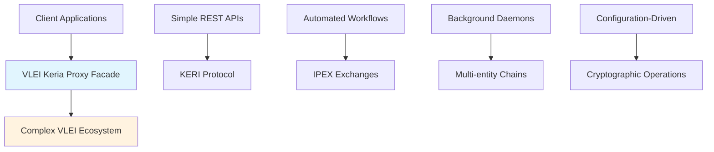
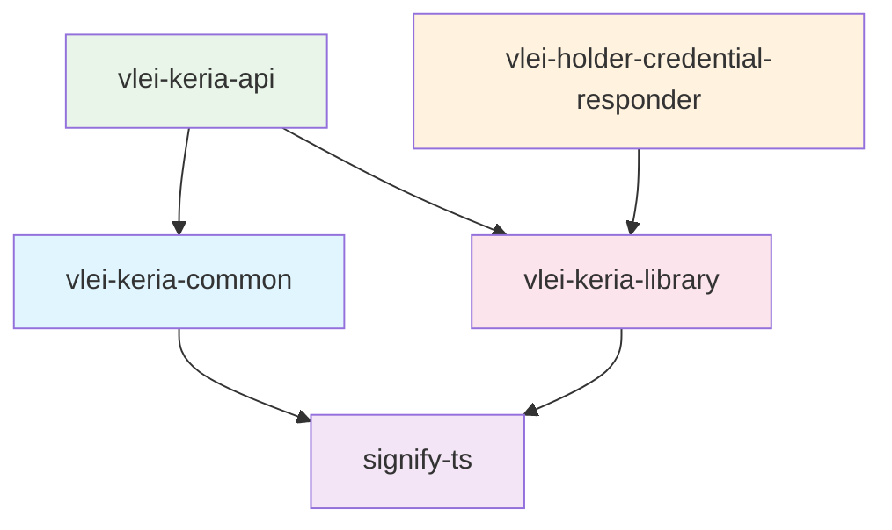

# VLEI Keria Proxy Services - Facade Architecture Documentation

## Overview

The **VLEI Keria Proxy** is a collection of microservices designed as a **facade layer** to abstract and simplify the complex underlying VLEI (Verifiable Legal Entity Identifier) ecosystem interactions. These services act as intermediary components that hide the intricate details of KERI protocol operations, credential management, and multi-entity communications behind clean, developer-friendly APIs.

## Facade Pattern Implementation

### Core Concept: Complexity Abstraction

The VLEI ecosystem involves multiple complex concepts and protocols:

- **KERI (Key Event Receipt Infrastructure)** protocol operations
- **IPEX (Issuance and Presentation Exchange)** workflows
- **ACDC (Authentic Chained Data Container)** credential formats
- **Multi-entity credential chains** and trust relationships
- **Cryptographic key management** and rotation
- **Distributed ledger interactions** and consensus mechanisms

**The VLEI Keria Proxy services transform this complexity into:**
- Simple REST API endpoints
- Automated background processes
- Standardized request/response formats
- Declarative configuration patterns
- Event-driven automation

### Facade Benefits



## Service Architecture

### 1. vlei-keria-api
**Role**: Primary REST API facade for credential operations

**Facade Purpose**: Transforms complex VLEI credential issuance and management into simple HTTP endpoints

#### Complexity Hidden:
- ✅ **KERI Entity Management**: Automatic entity initialization and client setup
- ✅ **Cryptographic Operations**: Key generation, signing, and verification
- ✅ **Registry Interactions**: Schema validation and registry communication
- ✅ **Multi-party Protocols**: IPEX grant flows and acknowledgments
- ✅ **Credential Chaining**: Edge credential relationships and dependencies

#### Simple Interface Exposed:
```http
# Issue Risk Lens Credential (hides complex VLEI workflow)
POST /api/v1/credentials/issue-risk-lens
{
  "riskIndicator": { "score": 75.5, "category": "medium-risk" },
  "creditLimit": { "amount": 100000, "currency": "USD" },
  "aid": "EKYLUMmNPuoqfVjLVbpkRAEldY3z7F8xzLJhRU7V89eI"
}

# Assign Credential to Application (abstracts IPEX grant protocol)
POST /api/v1/credentials/assign-to-application
{
  "targetAid": "EKYLUMmNPuoqfVjLVbpkRAEldY3z7F8xzLJhRU7V89eI"
}

# Revoke Credential (simplifies complex revocation workflow)
DELETE /api/v1/credentials/revoke
{
  "said": "credential-identifier"
}
```

#### Technical Implementation:
- **Framework**: Express.js with TypeScript
- **Validation**: express-validator with comprehensive input sanitization
- **Documentation**: Auto-generated Swagger/OpenAPI specifications
- **Security**: CORS, Helmet, input validation, structured error handling
- **Integration**: Direct vlei-keria-library integration with abstracted complexity

#### Key Features:
- 🔒 **Automatic Entity Setup**: Handles KERIA client initialization
- 📋 **Schema Management**: Built-in support for Risk Lens Badge schema
- 🔄 **Rules Generation**: Automatic disclaimer and rule creation using Saider.saidify()
- 🎯 **Target Assignment**: IPEX-based credential granting to applications
- 📊 **Health Monitoring**: Built-in health checks and status endpoints
- 📚 **Interactive Documentation**: Swagger UI for API exploration

### 2. vlei-holder-credential-responder
**Role**: Automated daemon for credential presentation workflows

**Facade Purpose**: Converts complex multi-party credential presentation protocols into automated background operations

#### Complexity Hidden:
- ✅ **IPEX Protocol Monitoring**: Continuous polling for presentation requests
- ✅ **Notification Processing**: Complex KERI notification parsing and filtering
- ✅ **Multi-client Coordination**: Managing multiple KERIA client connections
- ✅ **Presentation Workflows**: Automatic credential matching and offer generation
- ✅ **Error Recovery**: Retry logic, exponential backoff, and failure handling
- ✅ **Graceful Shutdown**: Signal handling and resource cleanup

#### Automated Operations:
```typescript
// Daemon automatically handles these complex workflows:
1. 📥 Monitor KERI notifications for IPEX apply messages
2. 🎯 Extract verifier information from presentation requests  
3. 🔍 Search holder credentials for schema matches
4. 📤 Generate and submit IPEX offer responses
5. 🔄 Handle retry logic for failed presentations
6. 📊 Provide detailed logging and error reporting
```

#### Configuration-Driven Setup:
```env
# Simple environment configuration hides complex setup
HOLDER_ALIAS=holder-entity
HOLDER_BRAN=SecretSeedValue
DEFAULT_ADMIN_URL=http://localhost:3901
DAEMON_CHECK_INTERVAL_MS=5000
MAX_NOTIFICATIONS_PER_BATCH=10
NOTIFICATION_RETRY_ATTEMPTS=3
```

#### Technical Implementation:
- **Runtime**: Node.js daemon with TypeScript
- **Protocol**: Direct signify-ts and vlei-keria-library integration
- **Monitoring**: Continuous polling with configurable intervals
- **Resilience**: Built-in retry logic and error recovery
- **Logging**: Color-coded console output with structured information
- **Lifecycle**: Graceful startup, shutdown, and signal handling

#### Key Features:
- 🤖 **Fully Automated**: No manual intervention required for presentations
- 🔄 **Continuous Operation**: 24/7 monitoring for presentation requests
- 📊 **Batch Processing**: Configurable notification processing limits
- 🛡️ **Error Resilience**: Automatic retry with exponential backoff
- 🎨 **Rich Logging**: Color-coded status updates and error reporting
- ⚙️ **Configurable**: Environment-based configuration management

### 3. vlei-keria-common
**Role**: Shared library providing common abstractions

**Facade Purpose**: Standardizes and simplifies common VLEI operations across all services

#### Complexity Hidden:
- ✅ **Type System Complexity**: Complex KERI/VLEI type definitions
- ✅ **Protocol Constants**: VLEI-specific identifiers and configurations
- ✅ **Utility Functions**: Cryptographic helpers and data transformations
- ✅ **Setup Procedures**: Entity initialization and client bootstrapping
- ✅ **Console Operations**: KERI agent interactions and debugging

#### Standardized Interfaces:
```typescript
// Simple, reusable type definitions
export interface Test {
  id: string;
  name: string;
  value: unknown;
  timestamp: Date;
}

// Utility functions abstract complex operations
export function isTest(obj: unknown): obj is Test;
export * from './keri';      // KERI protocol abstractions
export * from './setup';     // Entity setup procedures
export * from './console';   // Agent interaction utilities
```

#### Technical Implementation:
- **Package Type**: Shared TypeScript library
- **Distribution**: Local file dependency for development
- **Exports**: Comprehensive type definitions and utilities
- **Integration**: Used by both API and daemon services
- **Versioning**: Semantic versioning with build automation

#### Key Features:
- 📦 **Shared Types**: Common interfaces across all services
- 🔧 **Utility Functions**: Reusable helper functions and type guards
- 🏗️ **Setup Abstractions**: Simplified entity and client initialization
- 🎯 **Protocol Helpers**: KERI/VLEI-specific operation wrappers
- 📋 **Constants Management**: Centralized configuration values

## Inter-Service Communication

### Dependency Graph


### Integration Points

#### 1. **vlei-keria-library Integration**
```typescript
// Both services leverage the core library for VLEI operations
import { 
  initializeSignify,
  createEntity,
  issueEdgeCredential,
  holderReceivePresentationFlow,
  RISKLENS_BADGE_SCHEMA_SAID
} from 'vlei-keria-library';
```

#### 2. **Common Type System**
```typescript
// Shared types ensure consistency across services
import { Test, isTest } from 'vlei-keria-common';
```

#### 3. **Configuration Standardization**
```typescript
// Environment-based configuration patterns
DEFAULT_ADMIN_URL=http://localhost:3901
DEFAULT_BOOT_URL=http://localhost:3903  
SCHEMA_SERVER_HOST=http://localhost:7723
```

## Facade Design Patterns

### 1. **API Gateway Pattern** (vlei-keria-api)
```typescript
// Single entry point for all credential operations
app.use('/api/v1/credentials', credentialRoutes);

// Unified error handling
app.use(errorHandler);

// Consistent response format
return {
  success: true,
  data: result,
  timestamp: new Date().toISOString()
};
```

### 2. **Background Service Pattern** (vlei-holder-credential-responder)
```typescript
// Automated workflow orchestration
class VleiHolderDaemon {
  private async processNotifications() {
    // Hide complex IPEX protocol details
    const notifications = await this.getNotifications();
    await this.handlePresentationRequests(notifications);
  }
}
```

### 3. **Shared Kernel Pattern** (vlei-keria-common)
```typescript
// Common abstractions for domain concepts
export interface CredentialRequest {
  targetAid: string;
  credentialType: string;
  metadata?: Record<string, any>;
}
```

## Development Workflow Simplification

### Before Facade (Complex Direct Integration):
```typescript
// Developers had to manage all this complexity directly:
const signify = await initializeSignify();
const client = await signify.connect();
const entity = await createEntity(client, alias, bran);
const registry = await createRegistry(client, entity);
const rules = Saider.saidify(complexRulesObject)[1];
const credential = await issueEdgeCredential(
  issuerClient, issuerAlias, registrySaid, schemaSaid,
  recipientClient, recipientPrefix, data, edge, rules
);
```

### After Facade (Simplified Integration):
```typescript
// Developers now use simple API calls:
const response = await fetch('/api/v1/credentials/issue-risk-lens', {
  method: 'POST',
  headers: { 'Content-Type': 'application/json' },
  body: JSON.stringify({
    riskIndicator: { score: 75.5, category: 'medium-risk' },
    creditLimit: { amount: 100000, currency: 'USD' },
    aid: 'target-entity-aid'
  })
});
```

## Deployment and Operations

### Service Configuration
```yaml
# docker-compose.yml example for facade services
version: '3.8'
services:
  vlei-keria-api:
    build: ./vlei-keria-api
    ports:
      - "3000:3000"
    environment:
      - NODE_ENV=production
      - KERIA_LIBRARY_PATH=/app/node_modules/vlei-keria-library
    depends_on:
      - keria-agent

  vlei-holder-daemon:
    build: ./vlei-holder-credential-responder
    environment:
      - HOLDER_ALIAS=production-holder
      - DAEMON_CHECK_INTERVAL_MS=5000
    depends_on:
      - keria-agent
      - vlei-keria-api

  vlei-keria-common:
    build: ./vlei-keria-common
    volumes:
      - common-lib:/app/dist
```

### Monitoring and Observability
```typescript
// Built-in health checks and metrics
app.get('/health', (req, res) => {
  res.json({
    status: 'healthy',
    service: 'VLEI KERIA API',
    timestamp: new Date().toISOString(),
    dependencies: {
      keria: 'connected',
      library: 'loaded'
    }
  });
});
```

## Security and Compliance

### Security Features
- 🔒 **Input Validation**: Comprehensive request validation and sanitization
- 🛡️ **CORS Protection**: Configurable cross-origin resource sharing
- 🔐 **Helmet Integration**: Security headers and protection middleware
- 📊 **Audit Logging**: Detailed logging for compliance and debugging
- 🎯 **Rate Limiting**: Protection against abuse and DoS attacks

### Error Handling
```typescript
// Standardized error responses across all services
{
  "success": false,
  "error": {
    "code": "VALIDATION_ERROR",
    "message": "Human-readable error message",
    "details": "Additional context for debugging"
  },
  "timestamp": "2025-10-14T10:00:00.000Z"
}
```

## Benefits of the Facade Architecture

### For Developers
- ✅ **Reduced Learning Curve**: Simple APIs instead of complex protocols
- ✅ **Faster Integration**: REST endpoints vs. direct KERI implementation
- ✅ **Better Testing**: Mockable HTTP interfaces vs. cryptographic operations
- ✅ **Documentation**: Auto-generated API docs and examples
- ✅ **Error Handling**: Structured error responses with clear messages

### For Operations
- ✅ **Simplified Deployment**: Standard web services vs. complex agent networks
- ✅ **Monitoring**: HTTP health checks and standard metrics
- ✅ **Scaling**: Horizontal scaling of stateless API services
- ✅ **Configuration**: Environment variables vs. complex setup procedures
- ✅ **Automation**: Background daemons handle complex workflows

### For Business
- ✅ **Faster Time to Market**: Reduced development complexity
- ✅ **Lower Risk**: Abstracted complexity reduces implementation errors  
- ✅ **Better Maintainability**: Clear separation of concerns
- ✅ **Easier Integration**: Standard interfaces for ecosystem partners
- ✅ **Compliance**: Built-in security and audit capabilities

## Future Enhancements

### Planned Features
- 🔄 **Event Streaming**: Real-time credential status updates
- 📊 **Analytics Dashboard**: Credential issuance and presentation metrics  
- 🔐 **Authentication**: OAuth2/JWT-based API security
- 🌐 **Multi-tenant**: Support for multiple organization contexts
- 📱 **WebSocket Support**: Real-time notifications for web applications
- 🧪 **Testing Framework**: Comprehensive integration test suite

### Extensibility Points
- **Custom Schemas**: Plugin system for new credential types
- **Workflow Customization**: Configurable approval and validation flows
- **Integration Adapters**: Support for additional identity systems
- **Monitoring Extensions**: Custom metrics and alerting integrations

The VLEI Keria Proxy services successfully implement the facade pattern to transform the complex, cryptographic, and protocol-heavy VLEI ecosystem into accessible, developer-friendly services that maintain the security and integrity of the underlying system while dramatically reducing implementation complexity.