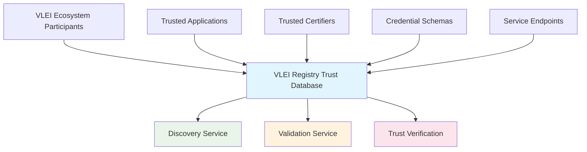
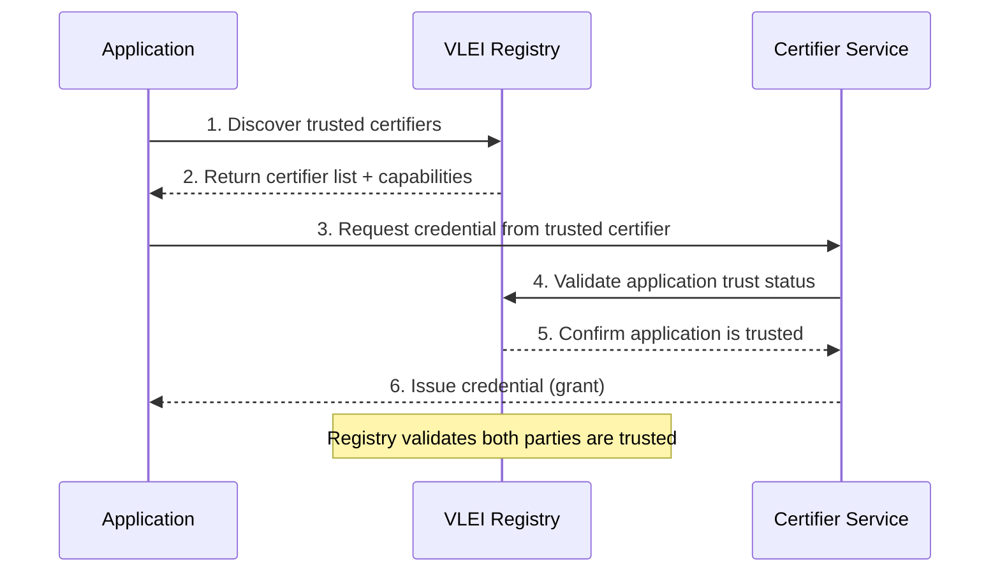
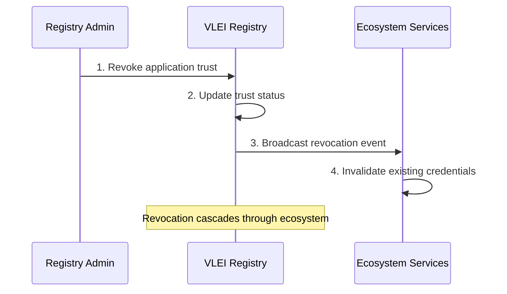

# VLEI Registry - Mock Trust Registry Service

## Overview

The **VLEI Registry** is a mocked implementation of a centralized trust registry service designed to maintain the authoritative lists of **trusted applications** and **trusted certifiers** within the VLEI (Verifiable Legal Entity Identifier) ecosystem. This service acts as the single source of truth for ecosystem discovery, enabling participants to find and validate trusted entities and their capabilities.

## 🎯 Purpose: Mock Registry for VLEI Ecosystem Trust

### Core Concept: Trust Registry Pattern

In a production VLEI ecosystem, the registry would be a distributed, consensus-based system maintained by GLEIF and ecosystem governance. This mock implementation simulates the essential registry functions:



### Registry Responsibilities

The VLEI Registry maintains critical trust infrastructure data:

- ✅ **Trusted Applications Registry**: Authorized applications that can participate in VLEI workflows
- ✅ **Trusted Certifiers Registry**: Authorized entities that can issue VLEI credentials  
- ✅ **Service Discovery**: API endpoints and portal URLs for ecosystem integration
- ✅ **Schema Management**: Credential schema identifiers and validation rules
- ✅ **Trust Chain Validation**: Verification of certifier authorization chains

## 🏗️ Architecture & Implementation

### Technology Stack
- **Framework**: ASP.NET Core 9.0 with minimal APIs
- **Data Storage**: In-memory repositories (ConcurrentDictionary)
- **API Documentation**: Swagger/OpenAPI with interactive UI
- **Configuration**: JSON-based seeding with appsettings.json
- **Testing**: PowerShell test scripts for API validation

### Service Components

#### 1. **Applications Registry** (`ApplicationsController`)

**Purpose**: Manages trusted applications that can request and verify VLEI credentials

**Data Model**:
```csharp
public class Application
{
    public string ApplicationId { get; set; }     // Unique identifier (e.g., "supplier-portal")
    public string Description { get; set; }      // Human-readable description
    public string CredentialSchema { get; set; } // Required credential schema SAID
    public string McpName { get; set; }          // MCP server name for integration  
    public string ApiUrl { get; set; }           // Application API endpoint
    public string PortalUrl { get; set; }        // User interface URL
}
```

**API Endpoints**:
```http
# Discovery: List all trusted applications
GET /api/Applications/list

# Details: Get full application information
GET /api/Applications/{applicationId}/details  

# Registration: Add new trusted application
POST /api/Applications
```

**Use Cases**:
- 🔍 **Application Discovery**: Find compatible applications for credential exchange
- 🎯 **Service Integration**: Retrieve API endpoints and MCP server details
- 📋 **Schema Validation**: Verify required credential schemas for applications
- 🔗 **Portal Access**: Direct users to application interfaces

#### 2. **Certifiers Registry** (`CertifiersController`)

**Purpose**: Maintains the list of authorized credential certifiers with their capabilities

**Data Model**:
```csharp
public class Certifier
{
    public string Id { get; set; }                    // Unique certifier identifier
    public List<string> BadgeTypes { get; set; }     // Supported credential schema SAIDs
    public string ContactUri { get; set; }           // Contact information for certifier
    public string Name { get; set; }                 // Certifier organization name
    public string Description { get; set; }          // Certifier role and capabilities
}
```

**API Endpoints**:
```http
# Discovery: List all trusted certifiers  
GET /api/Certifiers/list

# Details: Get full certifier information
GET /api/Certifiers/{certifierId}/details

# Registration: Add new trusted certifier
POST /api/Certifiers
```

**Use Cases**:
- 🏢 **Certifier Discovery**: Find authorized credential issuers
- 🎫 **Credential Type Matching**: Identify certifiers for specific badge types
- 📞 **Contact Resolution**: Get certifier contact information for validation
- 🔐 **Trust Verification**: Validate certifier authorization status

### 3. **Repository Pattern Implementation**

#### In-Memory Storage Strategy
```csharp
// Thread-safe concurrent storage for high-performance access
private readonly ConcurrentDictionary<string, Application> _applications;
private readonly ConcurrentDictionary<string, Certifier> _certifiers;

// Configuration-based seeding for mock data
public void SeedData(IEnumerable<Application> applications)
{
    foreach (var application in applications)
    {
        _applications.TryAdd(application.ApplicationId, application);
    }
}
```

**Benefits of In-Memory Approach**:
- ⚡ **High Performance**: Microsecond response times for registry lookups
- 🔄 **Real-time Updates**: Immediate consistency for grant/revoke operations
- 🧪 **Development-Friendly**: Easy data manipulation for testing scenarios
- 🏗️ **Stateless Design**: Each service instance maintains independent state

### Configuration-Based Data Seeding

#### Application Registry Seed Data
```json
{
  "ApplicationData": [
    {
      "ApplicationId": "supplier-portal",
      "Description": "Portal for companies looking for suppliers",
      "CredentialSchema": "ENPXp1vQzRF6JwIuS-mp2U8Uf1MoADoP_GqQ62VsDZWY",
      "McpName": "SupplierPortalMcp",
      "ApiUrl": "http://localhost:5178/",
      "PortalUrl": "http://localhost:3000/"
    },
    {
      "ApplicationId": "insurance-offers-portal", 
      "Description": "Sample application for managing insurance offers",
      "CredentialSchema": "ENPXp1vQzRF6JwIuS-mp2U8Uf1MoADoP_GqQ62VsDZWY",
      "McpName": "InsuranceMCP",
      "ApiUrl": "http://localhost:XXXXS/",
      "PortalUrl": "http://localhost:3000/"
    }
  ]
}
```

#### Certifier Registry Seed Data
```json
{
  "CertifierData": [
    {
      "Id": "CRIF",
      "BadgeTypes": [
        "ENiOJlEz0_UMIN-olC06myHv8163njRNjFCnePFNKHZH",  // Risk Assessment Badge
        "EAag5G3RpOTcIgmCJSkz6h_v4BkFhGDQFFYK2gMBVM7P"   // Company Information Badge
      ],
      "ContactUri": "https://contact.gleif.org/certifier",
      "Name": "CRIF risk and company information provider",
      "Description": "Global company managing information and risk assessment"
    }
  ]
}
```

## 🔄 Trust Management Operations

### Grant and Revoke Alignment

The registry is designed to stay **synchronized** with credential grant and revoke operations:

#### Grant Workflow Integration


#### Revoke Workflow Integration  


### Trust Status Management

#### Application Trust States
```typescript
enum ApplicationTrustStatus {
  TRUSTED = "trusted",           // Active, can receive credentials
  SUSPENDED = "suspended",       // Temporary suspension
  REVOKED = "revoked",          // Trust permanently revoked
  PENDING = "pending"           // Under review for trust
}
```

#### Certifier Authorization States
```typescript
enum CertifierAuthorizationStatus {
  AUTHORIZED = "authorized",     // Can issue credentials
  SUSPENDED = "suspended",       // Temporarily disabled
  REVOKED = "revoked",          // Authorization revoked
  PENDING = "pending"           // Under authorization review
}
```

## 🔍 Discovery and Validation Features

### 1. **Ecosystem Discovery Service**

#### Find Applications by Credential Type
```http
GET /api/Applications/list
# Returns all applications with their required credential schemas
# Enables discovery of applications that accept specific credential types
```

#### Find Certifiers by Badge Type
```http  
GET /api/Certifiers/list
# Returns all certifiers with their supported badge types
# Enables discovery of certifiers that can issue specific credentials
```

### 2. **Trust Validation Service**

#### Application Validation
```csharp
// Validate if application is trusted for credential reception
public async Task<bool> ValidateApplicationTrust(string applicationId)
{
    var application = await _applicationRepository.GetByIdAsync(applicationId);
    return application != null; // In production: check trust status
}
```

#### Certifier Validation
```csharp
// Validate if certifier is authorized for credential issuance
public async Task<bool> ValidateCertifierAuthorization(string certifierId, string badgeType)
{
    var certifier = await _certifierRepository.GetByIdAsync(certifierId);
    return certifier?.BadgeTypes.Contains(badgeType) ?? false;
}
```

### 3. **Service Integration Points**

#### MCP Server Integration
```json
{
  "McpName": "SupplierPortalMcp",
  "ApiUrl": "http://localhost:5178/",
  "PortalUrl": "http://localhost:3000/"
}
```

Applications registered in the trust registry include:
- **MCP Name**: For Model Context Protocol integration with AI agents
- **API URL**: For direct service-to-service communication
- **Portal URL**: For human user interface access

## 🧪 Development and Testing

### Local Development Setup

#### 1. **Start the Registry Service**
```bash
cd vlei-registry
dotnet run
# Registry starts on http://localhost:5137
```

#### 2. **Access Interactive Documentation**
```
http://localhost:5137/swagger
# Swagger UI for exploring and testing the API
```

#### 3. **Run API Tests**
```powershell
# Execute comprehensive API test suite
.\test-api.ps1

# Tests cover:
# - Application CRUD operations
# - Certifier CRUD operations  
# - Data validation scenarios
# - Error handling verification
```

### Mock Data Management

#### Seeding Test Data
The registry automatically seeds data from `appsettings.json` on startup:

```csharp
// Automatic data seeding during service initialization
static void InitializeRepositories(IServiceProvider services, IConfiguration configuration)
{
    // Seed applications from configuration
    var applicationData = configuration.GetSection("ApplicationData").Get<Application[]>();
    applicationRepository.SeedData(applicationData);
    
    // Seed certifiers from configuration  
    var certifierData = configuration.GetSection("CertifierData").Get<Certifier[]>();
    certifierRepository.SeedData(certifierData);
}
```

#### Runtime Data Manipulation
```csharp
// Applications and certifiers can be added via POST APIs
POST /api/Applications
POST /api/Certifiers

// In production: Would integrate with governance workflows
// Mock version: Immediate registration for testing
```

## 🚀 Production Deployment Considerations

### Future Production Implementation

In a real VLEI ecosystem, the registry would need:

#### 1. **Persistent Storage**
```csharp
// Replace in-memory storage with distributed database
services.AddDbContext<VleiRegistryContext>(options =>
    options.UsePostgreSQL(connectionString));
```

#### 2. **Governance Integration**  
```csharp
// Integration with GLEIF governance systems
public interface IGovernanceService
{
    Task<bool> ValidateApplicationRegistration(ApplicationRegistrationRequest request);
    Task<bool> ValidateCertifierAuthorization(CertifierAuthorizationRequest request);
}
```

#### 3. **Event Streaming**
```csharp
// Real-time updates via event streaming
public interface IRegistryEventService
{
    Task PublishApplicationRegistered(ApplicationRegisteredEvent evt);
    Task PublishCertifierRevoked(CertifierRevokedEvent evt);
}
```

#### 4. **Distributed Consensus**
```csharp
// Multi-node consensus for trust decisions
public interface IConsensusService
{
    Task<ConsensusResult> ProposeApplicationTrust(string applicationId);
    Task<ConsensusResult> ProposeCertifierRevocation(string certifierId);
}
```

### Security and Compliance

#### Authentication and Authorization
```csharp
// Production security requirements
[Authorize(Roles = "RegistryAdmin")]
public class ApplicationsController : ControllerBase

// API key validation for service-to-service calls  
[ApiKeyAuthorization]
public class CertifiersController : ControllerBase
```

#### Audit Trail
```csharp
// Complete audit logging for trust operations
public interface IAuditService  
{
    Task LogApplicationRegistration(string applicationId, string adminId);
    Task LogCertifierRevocation(string certifierId, string reason);
}
```

## 📊 API Reference

### Application Management

| Method | Endpoint | Description | Authentication |
|--------|----------|-------------|----------------|
| `GET` | `/api/Applications/list` | List all applications | None (Public Discovery) |
| `GET` | `/api/Applications/{id}/details` | Get application details | None (Public Discovery) |
| `POST` | `/api/Applications` | Register new application | Admin Required |

### Certifier Management  

| Method | Endpoint | Description | Authentication |
|--------|----------|-------------|----------------|
| `GET` | `/api/Certifiers/list` | List all certifiers | None (Public Discovery) |
| `GET` | `/api/Certifiers/{id}/details` | Get certifier details | None (Public Discovery) |
| `POST` | `/api/Certifiers` | Register new certifier | Admin Required |

### Health and Diagnostics

| Method | Endpoint | Description |
|--------|----------|-------------|
| `GET` | `/health` | Service health check |
| `GET` | `/swagger` | Interactive API documentation |

## 🎯 Integration Examples

### Chatbot Integration
```typescript
// VLEI Chatbot discovers applications via registry
const applications = await fetch('http://localhost:5137/api/Applications/list');
const certifiers = await fetch('http://localhost:5137/api/Certifiers/list');

// Use registry data to provide ecosystem guidance
const recommendations = buildEcosystemRecommendations(applications, certifiers);
```

### Supplier Portal Integration
```csharp
// Supplier Portal validates certifiers via registry
public async Task<bool> ValidateCertifier(string certifierId)
{
    var registryClient = new VleiRegistryClient("http://localhost:5137");
    var certifier = await registryClient.GetCertifierDetails(certifierId);
    return certifier != null && certifier.BadgeTypes.Contains(RequiredBadgeType);
}
```

### Keria Proxy Integration
```typescript
// Keria services discover trusted endpoints via registry
const applications = await registryService.getApplicationsBySchema(credentialSchema);
const targetEndpoints = applications.map(app => ({
    id: app.applicationId,
    apiUrl: app.apiUrl,
    mcpName: app.mcpName
}));
```

## 🔮 Future Enhancements

### Planned Features

#### 1. **Real-time Notifications**
- WebSocket connections for registry updates
- Push notifications for trust status changes
- Event-driven architecture for ecosystem synchronization

#### 2. **Advanced Query Capabilities**  
- Search by credential schema compatibility
- Filter by service capabilities and endpoints
- Geographic and jurisdictional filtering

#### 3. **Trust Metrics and Analytics**
- Application usage statistics and trends
- Certifier performance metrics
- Ecosystem health dashboards

#### 4. **Multi-tenancy Support**
- Organization-specific registry views
- Hierarchical trust relationships
- Federated registry synchronization

The VLEI Registry serves as the foundational trust infrastructure for the entire VLEI ecosystem, providing the essential discovery and validation services that enable secure, scalable credential exchange between trusted participants. This mock implementation demonstrates the core registry patterns while providing a development-friendly environment for ecosystem integration and testing.