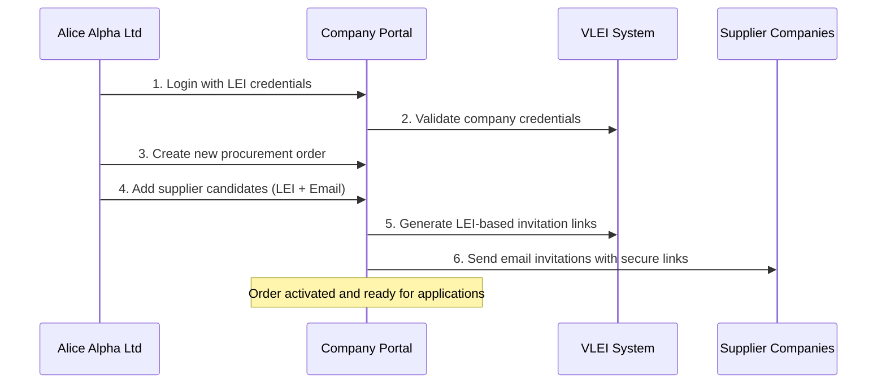
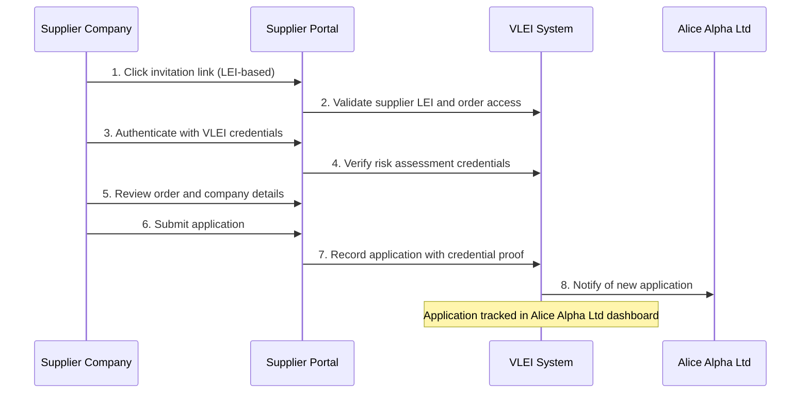

# VLEI Supplier Portal Web - Dual-Actor Procurement Platform

## Overview

The **VLEI Supplier Portal Web** is a sophisticated TypeScript React application that facilitates secure procurement workflows within the VLEI (Verifiable Legal Entity Identifier) ecosystem. The platform serves **two distinct actors** with separate interfaces and workflows, enabling seamless B2B interactions through authenticated credential exchange.

## 🎭 The Two Key Actors

### 🏢 Actor 1: Alice Alpha Ltd (The Requesting Company)

**Role**: The procurement initiator - a company seeking suppliers for specific orders

**Identity Profile**:
- **Legal Entity**: Alice Alpha Ltd
- **LEI**: Unique 20-character Legal Entity Identifier
- **VLEI Credentials**: Company LEI credentials for authentication
- **Business Context**: Established company with procurement needs

**Primary Workflows**:
1. **Company Authentication** - Login using LEI credentials via browser extension
2. **Order Management** - Create, view, and manage procurement orders
3. **Supplier Discovery** - Search and invite potential suppliers
4. **Application Review** - Monitor supplier responses and applications
5. **AI-Assisted Procurement** - Leverage chatbot for guidance and automation

### 🏭 Actor 2: Suppliers (The Service Providers)

**Role**: Companies invited to bid on procurement orders from Alice Alpha Ltd

**Identity Profile**:
- **Legal Entities**: Various supplier companies with LEI identifiers
- **LEI-Based Access**: Secure access through LEI-based invitation links
- **VLEI Credentials**: Risk assessment and company credentials
- **Business Context**: Service providers seeking procurement opportunities

**Primary Workflows**:
1. **Invitation Access** - Secure login via LEI-based invitation links
2. **Order Review** - Detailed examination of procurement requirements
3. **Credential Verification** - VLEI credential authentication for trust
4. **Application Submission** - Formal bidding process with credential validation
5. **Status Tracking** - Monitor application status and competition

## 📱 Application Pages and User Journeys

### 🏢 Alice Alpha Ltd Portal (`/company` route)

#### Page 1: Company Login (`CompanyLogin.tsx`)
**Purpose**: Secure authentication for Alice Alpha Ltd using VLEI credentials

**Key Features**:
- 🔐 **LEI Credential Authentication**: Browser extension integration for credential verification
- 🏢 **Company Validation**: Automatic validation against VLEI registry
- 💾 **Session Persistence**: localStorage-based session management
- 🎨 **TrustSphere Branding**: Professional corporate interface

**User Flow**:
1. Alice Alpha Ltd employee accesses company portal
2. Clicks "Login with LEI" button
3. Browser extension prompts for credential selection
4. System validates company LEI credentials
5. Successful authentication redirects to dashboard

```tsx
// Credential authentication flow
const credentialResponse = await extensionClient?.authorizeCred({
  message: `Login request at ${new Date().toISOString()}`,
  schema: { id: applicationDetails?.credentialSchemaAid || '' },
  target: applicationDetails?.aid || ''
});
```

#### Page 2: Company Dashboard (`CompanyDashboard.tsx`)
**Purpose**: Central command center for Alice Alpha Ltd's procurement activities

**Navigation Tabs**:

##### **Home Tab** - Company Information Hub
- **Company Profile Display**: Comprehensive company information with collapsible sections
  - General Information (LEI, creation date, jurisdiction, language)
  - Address Details (complete address information)
  - Technical Details (OOBI, prefix, alternative names, data timestamps)
- **Quick Actions Grid**: Fast access to key functions
  - View Orders, Create New Order, AI Assistant access
- **Notification Center**: Real-time notifications with badge counter
- **AI Chatbot Integration**: Context-aware assistance with company context

##### **Supplier Portal Tab** - Order Management
- **Orders Dashboard**: Complete order lifecycle management
- **Order Creation**: Structured order creation with supplier invitation system
- **Order Details**: In-depth order information with supplier application tracking
- **Application Monitoring**: Real-time tracking of supplier responses

**Dashboard Features**:
```tsx
// Notification system with real-time updates
const {
  notifications,
  notificationCount, 
  markAllAsRead,
  refresh: refreshNotifications
} = useNotifications(company.lei);
```

#### Page 3: Orders List (`OrdersList.tsx`)
**Purpose**: Master view of all procurement orders created by Alice Alpha Ltd

**Features**:
- 📋 **Order Grid Display**: Comprehensive list with key information
- 🔍 **Order Filtering**: Search and filter capabilities
- 📊 **Status Tracking**: Visual status indicators (Open, In Progress, Closed)
- 👥 **Supplier Overview**: Candidate count and application statistics
- ➕ **Quick Creation**: Direct access to order creation workflow

#### Page 4: Order Details (`OrderDetails.tsx`)
**Purpose**: Detailed order management and supplier application tracking

**Comprehensive Information**:
- **Order Specifications**: Complete order requirements and descriptions
- **Financial Information**: Total amount, payment terms, budget allocation
- **Supplier Candidates**: Detailed list of invited suppliers with status tracking
- **Application Timeline**: Real-time updates on supplier applications
- **Communication Tools**: Email invitation system with template generation

#### Page 5: Create Order (`CreateOrder.tsx`)
**Purpose**: Structured order creation with integrated supplier invitation

**Order Creation Workflow**:
1. **Basic Information**: Order ID, description, total amount
2. **Supplier Selection**: Add supplier candidates with LEI and email
3. **Email Template**: Customizable invitation email with order context
4. **Bulk Invitations**: Send personalized invitations to all candidates
5. **Order Activation**: Immediate order availability for supplier applications

### 🏭 Supplier Portal (`/supplier` route)

#### Page 6: Supplier Login (`SupplierLogin.tsx`)
**Purpose**: Secure supplier authentication via LEI-based invitation links

**Authentication Model**:
```
URL Format: /supplier?orderId=ORDER123&lei=12345678901234567890
```

**Security Features**:
- 🔗 **LEI-Based Access**: Invitation links include supplier LEI for validation
- 🎫 **Credential Verification**: VLEI credential authentication required
- 📋 **Order Context**: Display order information during login
- 🔒 **Session Isolation**: Order-specific session management

**Login Process**:
1. Supplier receives invitation email with secure LEI-based link
2. Clicks link to access supplier portal for specific order
3. System validates LEI from URL parameter
4. Browser extension prompts for VLEI credential authentication
5. System verifies risk assessment credentials
6. Successful authentication grants access to order application

#### Page 7: Supplier Portal (`SupplierPortal.tsx`)
**Purpose**: Complete supplier application interface with order details

**Application Sections**:

##### **Application Status** - Current State Display
- **Pending Status**: Clear indication of application opportunity
- **Applied Status**: Confirmation of successful submission
- **Competition Overview**: Insights into other candidate activity

##### **Requesting Company Information** - Alice Alpha Ltd Profile
- **Company Verification**: Complete Alice Alpha Ltd company profile
  - Legal name, LEI, jurisdiction, status
  - Full address and contact information
  - Company credibility indicators
- **Trust Indicators**: VLEI-verified company information for supplier confidence

##### **Order Details** - Procurement Specifications
- **Order Description**: Detailed requirements and specifications
- **Financial Information**: Total amount and payment structure
- **Timeline**: Creation date and application deadlines
- **Competition Metrics**: Total candidates and application statistics

##### **Supplier Company Profile** - Own Company Verification
- **Company Information**: Supplier's own company details
- **LEI Verification**: Confirmation of supplier LEI credentials
- **Address Information**: Supplier location and contact details
- **Credential Status**: VLEI credential validation status

##### **Application Submission** - Secure Bidding Process
```tsx
// Multi-step application process
const handleApply = async () => {
  // Step 1: Request credential from extension
  const credentialResponse = await extensionClient?.authorizeCred({
    schema: { id: applicationDetails?.requiredRiskSchemaCredentialAid },
    target: applicationDetails?.aid
  });
  
  // Step 2: Verify credentials
  await SupplierApiService.checkCredentials(issueePrefix, schemaAid);
  
  // Step 3: Submit application
  await SupplierApiService.applyAsSupplier(orderId, supplierLei);
};
```

## 🔄 Actor Interaction Workflows

### Workflow 1: Order Creation and Supplier Invitation



### Workflow 2: Supplier Application Process



## 🔐 Security and Authentication

### LEI-Based Security Model

**Alice Alpha Ltd Authentication**:
- Company LEI credentials required for portal access
- VLEI credential validation against company registry
- Session persistence with encrypted company data storage

**Supplier Authentication**:
- LEI-based invitation links with order-specific access
- Risk assessment credential verification required
- Credential validation for application submission

### VLEI Integration Points

```typescript
// Application credential requirements
interface ApplicationDetails {
  credentialSchemaAid: string;           // Required credential schema
  requiredRiskSchemaCredentialAid: string; // Risk assessment requirement
  aid: string;                           // Application identifier
}
```

## 🎨 User Experience Design

### TrustSphere Design System

**Visual Identity**:
- Professional corporate branding with TrustSphere logo
- Clean, Amazon-inspired design language
- Consistent color scheme and typography
- Responsive design for desktop and mobile

**User Interface Patterns**:
- **Collapsible Information Sections**: Organized company data presentation
- **Status Badges**: Clear visual indicators for application states
- **Loading States**: User feedback during credential operations
- **Error Modals**: Structured error handling with user guidance
- **Success Confirmations**: Clear feedback for completed actions

### Navigation Architecture

```typescript
// Route structure
/ (root)               → Redirect to /company
/company              → Alice Alpha Ltd Portal
  ├─ Login            → Company authentication
  └─ Dashboard        → Two-tab interface
     ├─ Home Tab      → Company profile and quick actions  
     └─ Portal Tab    → Order management (Orders → Details → Create)
     
/supplier?orderId&lei → Supplier Portal
  ├─ Login            → Supplier authentication with order context
  └─ Application      → Order review and application submission
```

## 🤖 AI Integration

### Context-Aware Chatbot

**Alice Alpha Ltd Context**:
- Company-specific guidance for procurement processes
- Order management assistance and best practices
- Supplier discovery recommendations
- VLEI ecosystem navigation support

**Supplier Context**:
- Application guidance and requirements explanation
- Credential verification assistance
- Order interpretation and clarification
- Competition insights and strategy recommendations

## 🔧 Technical Implementation

### Technology Stack
- **Frontend**: React 18 + TypeScript with Vite build system
- **State Management**: React hooks with localStorage persistence
- **Authentication**: VLEI browser extension integration
- **API Integration**: Axios-based service layer with error handling
- **Styling**: Custom CSS with responsive design system
- **Routing**: React Router v6 with protected routes

### Browser Extension Integration

```typescript
// VLEI credential authentication
const credentialResponse = await extensionClient?.authorizeCred({
  message: `Authentication request at ${new Date().toISOString()}`,
  schema: { id: credentialSchemaAid },
  target: applicationAid
});
```

### Session Management

**Alice Alpha Ltd Sessions**:
- Global company session with full portal access
- Persistent authentication across browser sessions
- Company data caching for performance

**Supplier Sessions**:
- Order-specific session isolation
- LEI-based session keys for security
- Automatic session cleanup on logout

## 🚀 Deployment and Integration

### Environment Configuration

```env
# Development
VITE_SUPPLIER_API_URL=http://localhost:5178  # Supplier Portal BFF
VITE_CHATBOT_API_URL=http://localhost:5184   # AI Chatbot API

# Production  
VITE_SUPPLIER_API_URL=https://api.supplier-portal.example.com
VITE_CHATBOT_API_URL=https://api.chatbot.example.com
```

### API Integration Points

**Supplier Portal BFF Integration**:
- Company data retrieval via LEI lookup
- Order CRUD operations with candidate management
- Application submission with VLEI credential verification
- Email invitation system with template generation

**Chatbot API Integration**:
- Context-aware conversation management
- Company-specific and supplier-specific assistance
- Multi-topic conversation threading
- HTML-formatted response rendering

## 📊 Business Value

### For Alice Alpha Ltd
- **Streamlined Procurement**: Efficient order creation and supplier management
- **Enhanced Security**: VLEI-based supplier verification and trust
- **Process Automation**: AI-assisted procurement workflow optimization  
- **Supplier Discovery**: Access to verified VLEI ecosystem suppliers
- **Real-time Tracking**: Complete visibility into application process

### For Suppliers
- **Secure Access**: LEI-based authentication with credential verification
- **Transparent Process**: Complete order and company information visibility
- **Trust Verification**: Access to Alice Alpha Ltd's verified company profile
- **Competitive Intelligence**: Insights into competition and application status
- **Streamlined Application**: Single-click application with credential validation

The VLEI Supplier Portal Web successfully creates a secure, efficient, and user-friendly platform that enables Alice Alpha Ltd to discover and engage with trusted suppliers while providing suppliers with transparent access to procurement opportunities through the VLEI ecosystem's trust infrastructure.